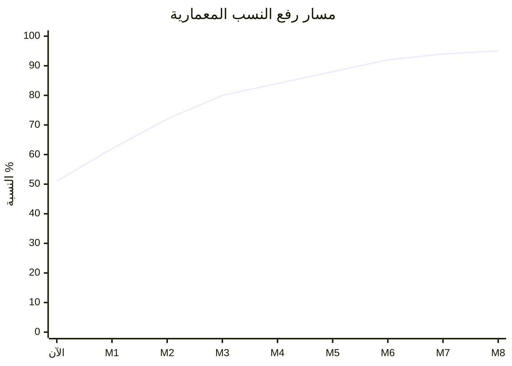
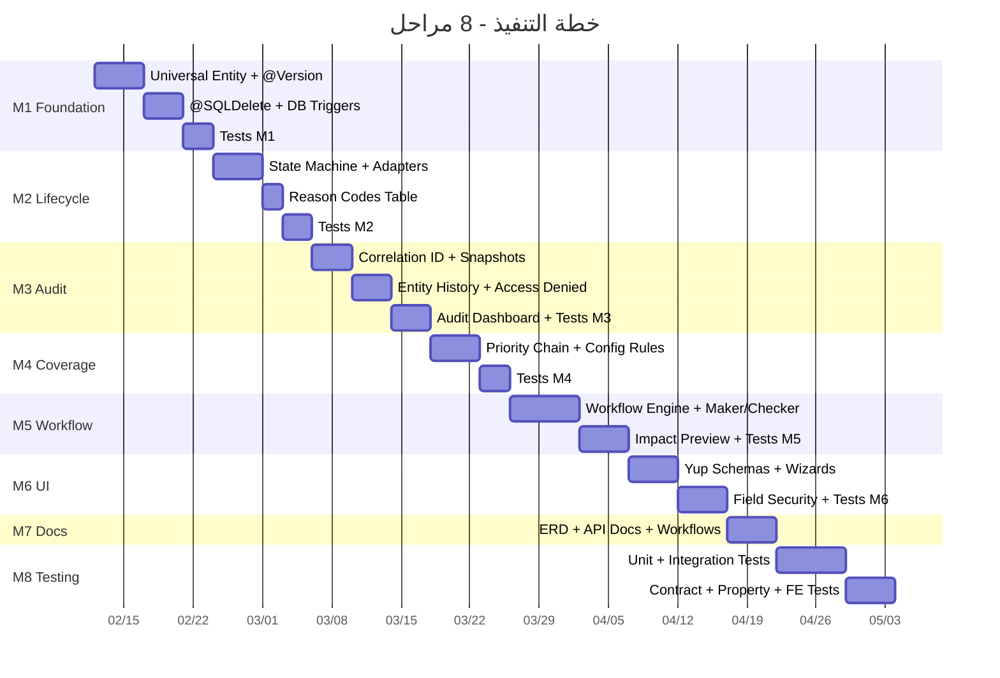

# 🗺️ خطة التنفيذ المرحلية الكاملة — حل جميع مشاكل التقرير المعماري

> **الهدف:** رفع نسبة تطبيق المعايير المعمارية من **51% → 95%+** مع تغطية اختبارات من **~15% → 80%+**  
> **عدد المراحل:** 8 مراحل | **المدة التقديرية:** 14-18 أسبوعًا  
> **المرجع:** [architecture_audit.md](file:///C:/Users/Omar/.gemini/antigravity/brain/3bf471e4-994e-4b4b-8fae-49050d2d0d25/architecture_audit.md)

---

## 📊 خريطة ربط المشاكل بالمراحل

| # | المشكلة من التقرير | المحور | النسبة الحالية | المرحلة | النسبة بعد الحل |
|---|-------------------|--------|---------------|---------|----------------|
| 1 | لا يوجد `@Version` (Optimistic Locking) | §4 Versioning | 10% | **M1** | 40% |
| 2 | لا يوجد `valid_from`/`valid_to` | §2, §4 | 10% | **M1** | 60% |
| 3 | [id](file:///d:/Backend/waadTbaSystem2026-main_final/waadTbaSystem2026-main/backend/src/main/java/com/waad/tba/common/lifecycle/dto/ValidationResult.java#12-15)/[status](file:///d:/Backend/waadTbaSystem2026-main_final/waadTbaSystem2026-main/backend/src/main/java/com/waad/tba/modules/claim/entity/ClaimAuditLog.java#239-262) غير موحد في Base Class | §2 Universal Entity | 40% | **M1** | 80% |
| 4 | `@SQLDelete` مفقود في معظم الكيانات | §2 | 40% | **M1** | 90% |
| 5 | DB Trigger لمنع Hard Delete | §3 Lifecycle | 60% | **M1** | 70% |
| 6 | لا يوجد State Machine رسمي | §3 Lifecycle | 60% | **M2** | 80% |
| 7 | Lifecycle مطبق فقط على BenefitPolicy | §3 | 60% | **M2** | 90% |
| 8 | لا يوجد Reason Code مرجعي | §3 | 60% | **M2** | 95% |
| 9 | لا يوجد Correlation IDs | §5 Audit | 55% | **M3** | 75% |
| 10 | Before/After Snapshots جزئي | §5 | 55% | **M3** | 85% |
| 11 | لا يوجد Audit Dashboard | §5, §10 | 55% | **M3** | 90% |
| 12 | لا يوجد Audit لمحاولات الوصول المرفوضة | §9 Security | 85% | **M3** | 90% |
| 13 | Coverage Priority غير رسمي | §6 Coverage | 75% | **M4** | 90% |
| 14 | القواعد في الكود وليس Config | §6 | 75% | **M4** | 95% |
| 15 | لا يوجد Workflow Engine مركزي | §1 Core Engines | 45% | **M5** | 70% |
| 16 | لا يوجد Maker/Checker | §8 Human Error | 30% | **M5** | 65% |
| 17 | لا يوجد Impact Preview عام | §8 | 30% | **M5** | 75% |
| 18 | لا يوجد Wizards (خطوات متعددة) | §8 | 30% | **M6** | 85% |
| 19 | لا يوجد Yup/Zod في Frontend | §7 Validation | 50% | **M6** | 80% |
| 20 | لا يوجد Field-level Security | §9 Security | 85% | **M6** | 95% |
| 21 | لا يوجد ERD رسمي | §10 Deliverables | 60% | **M7** | 90% |
| 22 | Append-only History غير موجود | §4 Versioning | 10% | **M3** | 80% |
| 23 | تغطية الاختبارات ~15% | عام | 15% | **M8** | 80%+ |

---

## المرحلة 1️⃣: الأساسيات والحماية من الأخطاء (Foundation & Safety Net)
**المدة:** 2 أسبوعًا | **يحل المشاكل:** #1, #2, #3, #4, #5

> [!IMPORTANT]
> هذه المرحلة تعالج **أضعف محور** في النظام (Versioning 10%) وترفعه إلى 60%.

### 1.1 توحيد الكيان الأساسي (Universal Entity Model) — يحل #3

#### [MODIFY] [SoftDeleteEntity.java](file:///d:/Backend/waadTbaSystem2026-main_final/waadTbaSystem2026-main/backend/src/main/java/com/waad/tba/common/entity/SoftDeleteEntity.java)
```diff
 @MappedSuperclass
 public abstract class SoftDeleteEntity {

+    @Id
+    @GeneratedValue(strategy = GenerationType.IDENTITY)
+    protected Long id;
+
+    @Version
+    @Column(name = "version")
+    protected Long version = 0L;
+
     @Column(nullable = false)
     protected boolean active = true;
+
+    @Column(name = "valid_from")
+    protected LocalDateTime validFrom;
+
+    @Column(name = "valid_to")
+    protected LocalDateTime validTo;

     @Column(name = "created_at", nullable = false, updatable = false)
     protected LocalDateTime createdAt;
```

### 1.2 إضافة `@SQLDelete` لجميع الكيانات — يحل #4

#### [MODIFY] كل كيان يرث من [SoftDeleteEntity](file:///d:/Backend/waadTbaSystem2026-main_final/waadTbaSystem2026-main/backend/src/main/java/com/waad/tba/common/entity/SoftDeleteEntity.java#20-57) يجب أن يضاف له:
```java
@SQLDelete(sql = "UPDATE table_name SET active = false, updated_at = NOW() WHERE id = ?")
@SQLRestriction("active = true")
```

**الكيانات المستهدفة:**
- [BenefitPolicy](file:///d:/Backend/waadTbaSystem2026-main_final/waadTbaSystem2026-main/backend/src/main/java/com/waad/tba/modules/benefitpolicy/entity/BenefitPolicy.java#31-299), [BenefitPolicyRule](file:///d:/Backend/waadTbaSystem2026-main_final/waadTbaSystem2026-main/frontend/src/pages/benefit-policies/BenefitPolicyRulesTab.jsx#439-781)
- [Member](file:///d:/Backend/waadTbaSystem2026-main_final/waadTbaSystem2026-main/backend/src/main/java/com/waad/tba/modules/claim/repository/ClaimRepository.java#145-150), `MemberChronicCondition`
- [Claim](file:///d:/Backend/waadTbaSystem2026-main_final/waadTbaSystem2026-main/backend/src/main/java/com/waad/tba/modules/claim/service/ClaimService.java#445-482), [ClaimLine](file:///d:/Backend/waadTbaSystem2026-main_final/waadTbaSystem2026-main/backend/src/main/java/com/waad/tba/modules/benefitpolicy/service/BenefitPolicyCoverageService.java#926-936)
- [ProviderContract](file:///d:/Backend/waadTbaSystem2026-main_final/waadTbaSystem2026-main/backend/src/test/java/com/waad/tba/ArchitecturalRulesRegressionTest.java#242-267), `ProviderContractPricingItem`
- [Visit](file:///d:/Backend/waadTbaSystem2026-main_final/waadTbaSystem2026-main/backend/src/main/java/com/waad/tba/modules/claim/repository/ClaimRepository.java#663-675), [PreAuthorization](file:///d:/Backend/waadTbaSystem2026-main_final/waadTbaSystem2026-main/backend/src/main/java/com/waad/tba/modules/claim/repository/ClaimRepository.java#151-156)
- `SettlementBatch`

### 1.3 Flyway Migrations — يحل #1, #2

#### [NEW] `V9001__add_universal_entity_columns.sql`
```sql
-- @Version column
ALTER TABLE benefit_policies ADD COLUMN IF NOT EXISTS version BIGINT DEFAULT 0;
ALTER TABLE members ADD COLUMN IF NOT EXISTS version BIGINT DEFAULT 0;
ALTER TABLE claims ADD COLUMN IF NOT EXISTS version BIGINT DEFAULT 0;
ALTER TABLE provider_contracts ADD COLUMN IF NOT EXISTS version BIGINT DEFAULT 0;
ALTER TABLE visits ADD COLUMN IF NOT EXISTS version BIGINT DEFAULT 0;
ALTER TABLE pre_authorizations ADD COLUMN IF NOT EXISTS version BIGINT DEFAULT 0;
ALTER TABLE settlement_batches ADD COLUMN IF NOT EXISTS version BIGINT DEFAULT 0;

-- Effective Dating columns
ALTER TABLE benefit_policies ADD COLUMN IF NOT EXISTS valid_from TIMESTAMP;
ALTER TABLE benefit_policies ADD COLUMN IF NOT EXISTS valid_to TIMESTAMP;
ALTER TABLE provider_contracts ADD COLUMN IF NOT EXISTS valid_from TIMESTAMP;
ALTER TABLE provider_contracts ADD COLUMN IF NOT EXISTS valid_to TIMESTAMP;
ALTER TABLE members ADD COLUMN IF NOT EXISTS valid_from TIMESTAMP;
ALTER TABLE members ADD COLUMN IF NOT EXISTS valid_to TIMESTAMP;
```

### 1.4 Database Trigger لمنع Hard Delete — يحل #5

#### [NEW] `V9002__prevent_hard_delete_trigger.sql`
```sql
CREATE OR REPLACE FUNCTION prevent_hard_delete()
RETURNS TRIGGER AS $$
BEGIN
    IF current_setting('app.allow_hard_delete', true) != 'true' THEN
        RAISE EXCEPTION 'Hard delete blocked. Use lifecycle engine.';
    END IF;
    RETURN OLD;
END;
$$ LANGUAGE plpgsql;

-- تطبيق على جميع الجداول الحساسة
CREATE TRIGGER trg_prevent_delete_policies BEFORE DELETE ON benefit_policies
    FOR EACH ROW EXECUTE FUNCTION prevent_hard_delete();
CREATE TRIGGER trg_prevent_delete_claims BEFORE DELETE ON claims
    FOR EACH ROW EXECUTE FUNCTION prevent_hard_delete();
CREATE TRIGGER trg_prevent_delete_members BEFORE DELETE ON members
    FOR EACH ROW EXECUTE FUNCTION prevent_hard_delete();
```

### 🧪 اختبارات المرحلة 1

```java
// ═══════ OptimisticLockingTest.java ═══════
@Test void testVersionIncrementsOnUpdate();
@Test void testConcurrentUpdateThrowsOptimisticLockException();
@Test void testVersionPreservedAfterSoftDelete();

// ═══════ EffectiveDatingTest.java ═══════
@Test void testValidFromSetOnCreation();
@Test void testValidToSetOnTermination();
@Test void testExpiredRecordsNotReturnedByDefault();
@Test void testHistoricalQueriesReturnExpiredRecords();

// ═══════ SoftDeleteGuardrailTest.java ═══════
@Test void testHardDeleteBlockedByTrigger();
@Test void testHardDeleteAllowedWithFlag();
@Test void testSoftDeleteSetsActiveToFalse();
@Test void testSQLDeleteAnnotationAppliedToAllEntities();  // Architectural
@Test void testSQLRestrictionFiltersDeletedRecords();

// ═══════ Architectural Tests (ArchitecturalRulesRegressionTest) ═══════
@Test void testAllMainTablesHaveVersionColumn();
@Test void testAllMainTablesHaveValidFromColumn();
@Test void testVersionColumnsNotNull();
```

---

## المرحلة 2️⃣: تعزيز Lifecycle Engine وتعميمه
**المدة:** 2 أسبوعًا | **يحل المشاكل:** #6, #7, #8

### 2.1 State Machine رسمي — يحل #6

#### [NEW] `LifecycleStateMachine.java`
```java
public class LifecycleStateMachine {
    private static final Map<String, Set<String>> TRANSITIONS = Map.of(
        "DRAFT",      Set.of("ACTIVE", "CANCELLED"),
        "ACTIVE",     Set.of("SUSPENDED", "TERMINATED"),
        "SUSPENDED",  Set.of("ACTIVE", "TERMINATED"),
        "TERMINATED", Set.of("ARCHIVED"),
        "CANCELLED",  Set.of("ARCHIVED"),
        "ARCHIVED",   Set.of()  // Terminal state
    );
    
    public boolean isTransitionAllowed(String from, String to) {
        return TRANSITIONS.getOrDefault(from, Set.of()).contains(to);
    }
}
```

### 2.2 محولات لجميع الكيانات — يحل #7

#### [NEW] `EmployerLifecycleAdapter.java`
#### [NEW] `ProviderLifecycleAdapter.java`
#### [NEW] `ClaimLifecycleAdapter.java`
#### [NEW] `MemberLifecycleAdapter.java`
#### [NEW] `ProviderContractLifecycleAdapter.java`

### 2.3 جدول Reason Codes المرجعي — يحل #8

#### [NEW] `V9003__create_lifecycle_reason_codes.sql`
```sql
CREATE TABLE lifecycle_reason_codes (
    id SERIAL PRIMARY KEY,
    code VARCHAR(50) UNIQUE NOT NULL,
    label_ar VARCHAR(200) NOT NULL,
    label_en VARCHAR(200),
    applicable_entities TEXT[], -- {'POLICY','CLAIM','MEMBER'}
    applicable_actions TEXT[],  -- {'CANCEL','TERMINATE'}
    active BOOLEAN DEFAULT true
);

INSERT INTO lifecycle_reason_codes (code, label_ar, applicable_entities, applicable_actions) VALUES
('CLIENT_REQUEST', 'طلب العميل', '{POLICY,MEMBER}', '{CANCEL,TERMINATE}'),
('NON_PAYMENT', 'عدم السداد', '{POLICY}', '{TERMINATE}'),
('DATA_ENTRY_ERROR', 'خطأ في الإدخال', '{POLICY,CLAIM,MEMBER}', '{CANCEL}'),
('EXPIRED_CONTRACT', 'انتهاء العقد', '{POLICY,PROVIDER_CONTRACT}', '{TERMINATE,ARCHIVE}'),
('FRAUD_DETECTED', 'اكتشاف احتيال', '{CLAIM,MEMBER}', '{TERMINATE}'),
('DUPLICATE', 'سجل مكرر', '{CLAIM,MEMBER}', '{CANCEL}'),
('TEST_DATA', 'بيانات اختبارية', '{POLICY,CLAIM,MEMBER}', '{CANCEL}');
```

### 🧪 اختبارات المرحلة 2

```java
// ═══════ LifecycleStateMachineTest.java ═══════
@Test void testDraftToActiveAllowed();
@Test void testActiveToSuspendedAllowed();
@Test void testDraftToTerminatedBlocked();
@Test void testArchivedToAnyBlocked();
@Test void testSameToSameBlocked();
@Test void testNullStatusThrowsException();

// ═══════ AdapterTests (لكل محول) ═══════
@Test void testClaimAdapter_PaidClaimCanOnlyArchive();
@Test void testClaimAdapter_DraftClaimCanCancel();
@Test void testMemberAdapter_ActiveWithClaimsCanOnlyTerminate();
@Test void testEmployerAdapter_WithActivePoliciesCannotCancel();
@Test void testProviderContractAdapter_ExpiredCanArchive();

// ═══════ ReasonCodeTest.java ═══════
@Test void testReasonCodeRequiredForCancel();
@Test void testReasonCodeValidatedAgainstEntity();
@Test void testInvalidReasonCodeRejected();
@Test void testReasonCodeApplicableActionsFiltered();
```

---

## المرحلة 3️⃣: تعزيز التدقيق والتتبع (Audit & Compliance)
**المدة:** 2 أسبوعًا | **يحل المشاكل:** #9, #10, #11, #12, #22

### 3.1 Correlation ID — يحل #9

#### [NEW] `CorrelationIdFilter.java`
```java
@Component
public class CorrelationIdFilter extends OncePerRequestFilter {
    public static final String HEADER = "X-Correlation-ID";
    private static final ThreadLocal<String> CORRELATION_ID = new ThreadLocal<>();
    
    @Override
    protected void doFilterInternal(HttpServletRequest req, HttpServletResponse res, FilterChain chain) {
        String id = Optional.ofNullable(req.getHeader(HEADER))
                            .orElse(UUID.randomUUID().toString());
        CORRELATION_ID.set(id);
        res.setHeader(HEADER, id);
        try { chain.doFilter(req, res); }
        finally { CORRELATION_ID.remove(); }
    }
    
    public static String current() { return CORRELATION_ID.get(); }
}
```

### 3.2 Before/After Snapshots العام — يحل #10

#### [NEW] `AuditEntityListener.java` — JPA `@EntityListener` يُسجل تلقائياً
#### [MODIFY] [AuditLog.java](file:///d:/Backend/waadTbaSystem2026-main_final/waadTbaSystem2026-main/backend/src/main/java/com/waad/tba/modules/claim/entity/ClaimAuditLog.java) — إضافة `correlationId`, `beforeSnapshot`, `afterSnapshot`

### 3.3 Append-Only Entity History — يحل #22

#### [NEW] `V9004__create_entity_history.sql`
```sql
CREATE TABLE entity_history (
    id BIGSERIAL PRIMARY KEY,
    entity_type VARCHAR(50) NOT NULL,
    entity_id BIGINT NOT NULL,
    version BIGINT NOT NULL,
    snapshot JSONB NOT NULL,
    changed_by BIGINT,
    changed_at TIMESTAMP DEFAULT NOW(),
    change_type VARCHAR(20) NOT NULL, -- CREATE, UPDATE, SOFT_DELETE
    correlation_id VARCHAR(36),
    UNIQUE(entity_type, entity_id, version)
);
CREATE INDEX idx_entity_history_lookup ON entity_history(entity_type, entity_id);
```

### 3.4 تسجيل محاولات الوصول المرفوضة — يحل #12

#### [MODIFY] [RbacSecurityAspect.java](file:///d:/Backend/waadTbaSystem2026-main_final/waadTbaSystem2026-main/backend/src/main/java/com/waad/tba/security/rbac/RbacSecurityAspect.java) — إضافة logging عند رفض الوصول
```java
// عند رفض الوصول:
auditLogService.logAccessDenied(
    currentUser, targetEntity, requiredPermission, CorrelationIdFilter.current()
);
```

### 3.5 Audit Dashboard (Frontend) — يحل #11

#### [NEW] `AuditDashboard.jsx`
- عرض آخر 100 عملية مع فلاتر (entityType, user, dateRange)
- ربط بـ Correlation ID لتتبع سلسلة العمليات
- Timeline view لعرض تاريخ كيان واحد

### 🧪 اختبارات المرحلة 3

```java
// ═══════ CorrelationIdTest.java ═══════
@Test void testCorrelationIdGeneratedPerRequest();
@Test void testCorrelationIdPropagatedToAuditLog();
@Test void testCorrelationIdFromHeaderUsedIfPresent();
@Test void testMultipleAuditEntriesShareCorrelationId();

// ═══════ EntitySnapshotTest.java ═══════
@Test void testBeforeSnapshotCapturedOnUpdate();
@Test void testAfterSnapshotCapturedOnUpdate();
@Test void testSensitiveFieldsMaskedInSnapshot();
@Test void testSnapshotHandlesNullFields();
@Test void testSnapshotHandlesCollections();

// ═══════ EntityHistoryTest.java ═══════
@Test void testCreateSavesHistoryVersion1();
@Test void testUpdateIncrementsHistoryVersion();
@Test void testSoftDeleteSavesHistory();
@Test void testHistoryIsAppendOnly();
@Test void testCurrentVersionResolution();
@Test void testHistoryQueryByEntityTypeAndId();

// ═══════ AccessDeniedAuditTest.java ═══════
@Test void testAccessDeniedLogged();
@Test void testAccessDeniedIncludesTargetEntity();
@Test void testAccessDeniedIncludesRequiredPermission();
```

---

## المرحلة 4️⃣: Coverage Resolution المتقدم
**المدة:** 1.5 أسبوعًا | **يحل المشاكل:** #13, #14

### 4.1 سلسلة الأولوية الرسمية — يحل #13

#### [MODIFY] [BenefitPolicyCoverageService.java](file:///d:/Backend/waadTbaSystem2026-main_final/waadTbaSystem2026-main/backend/src/main/java/com/waad/tba/modules/benefitpolicy/service/BenefitPolicyCoverageService.java)
```java
public BigDecimal resolveCoverage(Long policyId, Long serviceId) {
    // Priority Chain (أعلى أولوية أولاً):
    // 1. Service Override — قاعدة خاصة بالخدمة
    // 2. Package Rule — قاعدة الحزمة الطبية
    // 3. Classification Rule — قاعدة التصنيف
    // 4. Category Rule — قاعدة التصنيف العام
    // 5. Global Default — القيمة الافتراضية للوثيقة
    
    return resolveByPriority(policyId, serviceId);
}
```

### 4.2 Configuration-Driven Rules — يحل #14

#### [NEW] `V9005__create_coverage_rule_config.sql`
```sql
CREATE TABLE coverage_rule_config (
    id SERIAL PRIMARY KEY,
    rule_level VARCHAR(30) NOT NULL, -- SERVICE, PACKAGE, CLASSIFICATION, CATEGORY, DEFAULT
    priority INT NOT NULL,           -- 1 = highest
    entity_type VARCHAR(50),
    entity_id BIGINT,
    coverage_percent DECIMAL(5,2),
    max_amount DECIMAL(12,2),
    requires_pre_auth BOOLEAN DEFAULT false,
    waiting_days INT DEFAULT 0,
    policy_id BIGINT REFERENCES benefit_policies(id),
    active BOOLEAN DEFAULT true
);
```

#### [NEW] `CoverageRuleConfigService.java` — يقرأ القواعد من DB بدلاً من الكود

### 🧪 اختبارات المرحلة 4

```java
// ═══════ CoveragePriorityChainTest.java ═══════
@Test void testServiceOverrideBeatsCategory();
@Test void testPackageRuleBeatsClassification();
@Test void testClassificationRuleBeatsCategory();
@Test void testCategoryRuleBeatsDefault();
@Test void testDefaultUsedWhenNoRules();
@Test void testZeroCoverageBlocksService();
@Test void testHundredPercentFullyCovered();
@Test void testInactiveRuleSkipped();

// ═══════ ConfigDrivenRulesTest.java ═══════
@Test void testRulesLoadedFromDatabase();
@Test void testRuleChangeTakesEffectImmediately();
@Test void testRulePriorityOrderRespected();
@Test void testNoCodeChangeNeededForNewRule();
```

---

## المرحلة 5️⃣: Workflow Engine & Maker/Checker
**المدة:** 2.5 أسبوعًا | **يحل المشاكل:** #15, #16, #17

### 5.1 Workflow Engine المركزي — يحل #15

#### [NEW] `WorkflowDefinition.java` (Entity)
```java
@Entity
public class WorkflowDefinition {
    private Long id;
    private String name;              // CLAIM_APPROVAL, SETTLEMENT
    private String entityType;
    private String triggerCondition;   // JSON: {"field":"amount","op":">","value":5000}
    private List<WorkflowStep> steps;
}
```

#### [NEW] `WorkflowStep.java` (Entity)
```java
@Entity
public class WorkflowStep {
    private Long id;
    private int stepOrder;
    private String assignedRole;       // REVIEWER, INSURANCE_ADMIN
    private String action;             // APPROVE, REJECT, ESCALATE
    private boolean requiresComment;
}
```

#### [NEW] `WorkflowEngineService.java`

### 5.2 Maker/Checker Pattern — يحل #16

#### [NEW] `ApprovalRequest.java` (Entity)
```java
@Entity
public class ApprovalRequest {
    private Long id;
    private String entityType;
    private Long entityId;
    private String requestedAction;
    private Long requestedBy;         // Maker
    private Long approvedBy;          // Checker
    private ApprovalStatus status;    // PENDING, APPROVED, REJECTED, EXPIRED
    private String dataSnapshot;      // JSONB
    private LocalDateTime expiresAt;  // TTL
    private String correlationId;
}
```

### 5.3 Impact Preview API — يحل #17

#### [NEW] `ImpactPreviewService.java`
#### [NEW] `ImpactPreviewController.java` — `GET /impact/preview/{entityType}/{id}/{action}`

### 🧪 اختبارات المرحلة 5

```java
// ═══════ WorkflowEngineTest.java ═══════
@Test void testClaimAboveThresholdTriggersWorkflow();
@Test void testClaimBelowThresholdAutoApproved();
@Test void testWorkflowStepsExecuteInOrder();
@Test void testWorkflowEscalationWorks();
@Test void testWorkflowDefinitionLoadedFromDB();

// ═══════ MakerCheckerTest.java ═══════
@Test void testMakerCreatesRequest();
@Test void testCheckerApprovesRequest();
@Test void testCheckerRejectsRequest();
@Test void testMakerCannotApproveOwnRequest();
@Test void testAlreadyApprovedCannotReApprove();
@Test void testExpiredRequestAutoRejected();
@Test void testApprovalExecutesAction();
@Test void testApprovalCreatesAuditLog();

// ═══════ ImpactPreviewTest.java ═══════
@Test void testPreviewShowsAffectedMemberCount();
@Test void testPreviewShowsPendingClaimsAmount();
@Test void testPreviewShowsFinancialImpact();
@Test void testPreviewReturnsWarningsForHighImpact();
@Test void testPreviewForEmptyEntityReturnsZero();
```

---

## المرحلة 6️⃣: UI Validation & Security Enhancement
**المدة:** 2 أسبوعًا | **يحل المشاكل:** #18, #19, #20

### 6.1 Schema-Based Validation (Yup/Zod) — يحل #19

#### [NEW] `validationSchemas/claimSchema.js`
```javascript
import * as Yup from 'yup';

export const claimSchema = Yup.object({
    visitId: Yup.number().required('الزيارة مطلوبة'),
    serviceId: Yup.number().required('الخدمة مطلوبة'),
    requestedAmount: Yup.number()
        .positive('المبلغ يجب أن يكون أكبر من صفر')
        .max(999999, 'المبلغ يتجاوز الحد الأقصى')
        .required('المبلغ مطلوب'),
    notes: Yup.string().max(500, 'الملاحظات طويلة جداً')
});
```

**المخططات المستهدفة:**
- `claimSchema.js`, `memberSchema.js`, `policySchema.js`
- `providerSchema.js`, `employerSchema.js`, `preAuthSchema.js`

### 6.2 Multi-Step Wizards — يحل #18

#### [NEW] `FormWizard.jsx` — مكون عام قابل لإعادة الاستخدام
```jsx
<FormWizard steps={[
    { label: 'البيانات الأساسية', component: <Step1 /> },
    { label: 'التغطية', component: <Step2 /> },
    { label: 'المراجعة', component: <ReviewStep /> }
]} onComplete={handleSubmit} />
```

**تطبيق على:**
- إنشاء وثيقة منافع (BenefitPolicy)
- إضافة عضو جديد
- إنشاء عقد مقدم خدمة

### 6.3 Field-Level Security — يحل #20

#### [NEW] `FieldSecurityService.java`
```java
@Service
public class FieldSecurityService {
    // يحدد الحقول المخفية حسب الدور
    private static final Map<String, Set<String>> HIDDEN_FIELDS = Map.of(
        "EMPLOYER_ADMIN", Set.of("nationalId", "bankAccount", "salary"),
        "PROVIDER", Set.of("nationalId", "employerDetails", "salary"),
        "REVIEWER", Set.of("bankAccount", "salary")
    );
    
    public <T> T filterFields(T dto, String role) { ... }
}
```

#### [NEW] `@SecureField` Annotation — للتعليم التوضيحي على الحقول
#### [MODIFY] DTOs — إضافة `@SecureField(hiddenFor = {"PROVIDER", "EMPLOYER_ADMIN"})`

### 🧪 اختبارات المرحلة 6

```java
// ═══════ FieldSecurityTest.java ═══════
@Test void testProviderCannotSeeNationalId();
@Test void testEmployerAdminCannotSeeBankAccount();
@Test void testSuperAdminSeesAllFields();
@Test void testNullFieldsHandledGracefully();

// ═══════ Frontend Tests ═══════
// claimSchema.test.js
@Test void testClaimSchema_RejectsNegativeAmount();
@Test void testClaimSchema_RejectsMissingVisitId();
@Test void testClaimSchema_AcceptsValidData();

// FormWizard.test.jsx
@Test void testWizardShowsCorrectSteps();
@Test void testWizardBlocksNextOnInvalidStep();
@Test void testWizardSubmitsOnLastStep();
```

---

## المرحلة 7️⃣: التوثيق والمخرجات (Deliverables)
**المدة:** 1 أسبوع | **يحل المشكلة:** #21

### 7.1 ERD Diagrams — يحل #21

#### [NEW] `docs/erd/` — مخططات Mermaid ERD لكل وحدة:
- `core_entities_erd.md` — الكيانات الأساسية
- `claim_workflow_erd.md` — دورة حياة المطالبة
- `coverage_resolution_erd.md` — تحديد التغطية
- `lifecycle_engine_erd.md` — محرك دورة الحياة
- `rbac_erd.md` — الصلاحيات والأدوار

#### [NEW] `docs/api/` — OpenAPI Spec مُحدَّث
#### [NEW] `docs/workflows/` — Sequence diagrams لكل دورة عمل

---

## المرحلة 8️⃣: التغطية الاختبارية الشاملة
**المدة:** 2 أسبوعًا | **يحل المشكلة:** #23

### 8.1 Unit Tests — المطالبات والخدمات الأساسية

| الملف | عدد الاختبارات | الأولوية |
|-------|---------------|----------|
| `ClaimServiceTest.java` | 20+ | P0 |
| `EligibilityRuleChainTest.java` | 15+ | P0 |
| `BenefitPolicyCoverageServiceTest.java` | 15+ | P0 |
| `SettlementServiceTest.java` | 12+ | P1 |
| [MemberServiceTest.java](file:///d:/Backend/waadTbaSystem2026-main_final/waadTbaSystem2026-main/backend/src/test/java/com/waad/tba/modules/member/service/UnifiedMemberServiceTest.java) | 10+ | P1 |
| `ProviderServiceTest.java` | 8+ | P2 |
| `EmployerServiceTest.java` | 8+ | P2 |

### 8.2 Integration Tests — دورات العمل الكاملة

| الملف | مايختبره |
|-------|---------|
| `ClaimWorkflowIntegrationTest.java` | Create → Approve → Settle |
| `EligibilityIntegrationTest.java` | أهلية مع DB حقيقية |
| `LifecycleIntegrationTest.java` | تغيير الحالة → Audit → Notification |
| `MakerCheckerIntegrationTest.java` | Request → Approve → Execute |
| `SecurityIntegrationTest.java` | RBAC + Field Security |

### 8.3 Contract Tests — شكل API

```java
@WebMvcTest(ClaimController.class)
class ClaimControllerContractTest {
    @Test void testCreateClaim_Returns201();
    @Test void testCreateClaim_InvalidBody_Returns400();
    @Test void testGetClaim_NotFound_Returns404();
    @Test void testGetClaim_Unauthorized_Returns403();
}
```

### 8.4 Property-Based Tests — اكتشاف حالات لا تخطر ببالك

```java
@Property void testCoverageNeverExceeds100Percent(...);
@Property void testApprovedAmountNeverNegative(...);
@Property void testPatientSharePlusInsuranceEqualsTotal(...);
@Property void testEligibilityIsDeterministic(...);
```

### 8.5 Frontend Tests

| الملف | مايختبره |
|-------|---------|
| `LifecycleActionModal.test.jsx` | عرض الخيارات، التأكيد |
| `BenefitPoliciesList.test.jsx` | الجدول، الفلاتر |
| `ClaimForm.test.jsx` | Yup validation |
| `RBACGuard.test.jsx` | إخفاء/إظهار |
| `FormWizard.test.jsx` | التنقل بين الخطوات |
| `AuditDashboard.test.jsx` | عرض السجلات |

---

## 📈 مخطط النسب المستهدفة



## 📅 الجدول الزمني



## Verification Plan

### Automated Tests
- `mvn test` — جميع الاختبارات (Unit + Integration)
- `mvn verify -Pcoverage` — تقرير JaCoCo (هدف: 80%+)
- `npm test --coverage` — تغطية الواجهة الأمامية

### Manual Verification
- مراجعة ERD لكل وحدة
- اختبار Maker/Checker flow يدوياً
- التحقق من Audit Dashboard
- اختبار Wizard flow في الواجهة الأمامية
