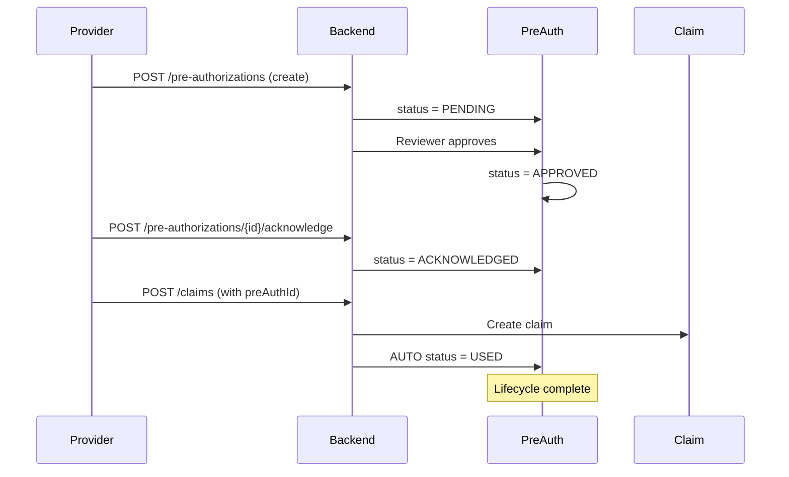

# ✅ Pre-Authorization Lifecycle - Backend Implementation Complete

**Date:** February 2, 2026  
**Phase:** 5.1 - Pre-Authorization Business Flow Completion  
**Status:** ✅ BACKEND COMPLETE

---

## 📊 Changes Implemented

### 1. ✅ Added ACKNOWLEDGED Status to Enum
**File:** `backend/src/main/java/com/waad/tba/modules/preauthorization/entity/PreAuthorization.java`

**Change:**
```java
public enum PreAuthStatus {
    PENDING("معلق"),
    UNDER_REVIEW("قيد المراجعة"),
    APPROVAL_IN_PROGRESS("جاري معالجة الموافقة"),
    APPROVED("موافق عليه"),
    ACKNOWLEDGED("تم الاطلاع"),  // ✅ NEW STATUS ADDED
    REJECTED("مرفوض"),
    EXPIRED("منتهي"),
    CANCELLED("ملغي"),
    USED("مستخدم");
}
```

**Lifecycle Flow:**
```
PENDING → UNDER_REVIEW → APPROVAL_IN_PROGRESS → APPROVED
                                                    ↓
                                               ACKNOWLEDGED ← NEW
                                                    ↓
                                                  USED
```

---

### 2. ✅ Added Acknowledge Method to Service
**File:** `backend/src/main/java/com/waad/tba/modules/preauthorization/service/PreAuthorizationService.java`

**New Method:**
```java
@Transactional
public PreAuthorizationResponseDto acknowledgePreAuthorization(Long id, String acknowledgedBy) {
    // Validates APPROVED status
    // Transitions to ACKNOWLEDGED
    // Logs audit trail
    // Returns response
}
```

**Validation:**
- Only APPROVED pre-auths can be acknowledged
- Throws IllegalStateException if wrong status

---

### 3. ✅ Added Mark As Used Method to Service
**File:** `backend/src/main/java/com/waad/tba/modules/preauthorization/service/PreAuthorizationService.java`

**New Method:**
```java
@Transactional
public PreAuthorizationResponseDto markAsUsed(Long id, String claimNumber, String updatedBy) {
    // Validates APPROVED or ACKNOWLEDGED status
    // Transitions to USED
    // Logs audit trail with claim number
    // Returns response
}
```

**Validation:**
- Only APPROVED or ACKNOWLEDGED pre-auths can be marked as USED
- Throws IllegalStateException if wrong status

---

### 4. ✅ Added Acknowledge Endpoint to Controller
**File:** `backend/src/main/java/com/waad/tba/modules/preauthorization/controller/PreAuthorizationController.java`

**New Endpoint:**
```
POST /api/v1/pre-authorizations/{id}/acknowledge
```

**Authorization:** `hasRole('SUPER_ADMIN') or hasAuthority('CREATE_PRE_AUTH')`  
**Response:** `PreAuthorizationResponse` (API v1 format)  
**Usage:** Provider portal calls this when viewing approved pre-auth

---

### 5. ✅ Added Mark As Used Endpoint to Controller
**File:** `backend/src/main/java/com/waad/tba/modules/preauthorization/controller/PreAuthorizationController.java`

**New Endpoint:**
```
POST /api/v1/pre-authorizations/{id}/mark-used?claimNumber=...
```

**Authorization:** `hasRole('SUPER_ADMIN') or hasAuthority('APPROVE_CLAIMS')`  
**Parameters:** 
- `claimNumber` (optional) - Claim reference for audit trail  
**Response:** `PreAuthorizationResponse` (API v1 format)  
**Usage:** Manual marking (mostly used automatically by ClaimService)

---

### 6. ✅ Auto-Mark USED When Claim Created
**File:** `backend/src/main/java/com/waad/tba/modules/claim/service/ClaimService.java`

**Enhancement in `createClaim()`:**
```java
// PHASE 5: Auto-mark PreAuthorization as USED when linked to claim
if (savedClaim.getPreAuthorization() != null) {
    PreAuthorization preAuth = savedClaim.getPreAuthorization();
    
    if (preAuth.getStatus() == PreAuthStatus.APPROVED || 
        preAuth.getStatus() == PreAuthStatus.ACKNOWLEDGED) {
        
        preAuthorizationService.markAsUsed(
            preAuth.getId(), 
            savedClaim.getClaimNumber(), 
            createdBy
        );
        log.info("✅ Pre-authorization {} auto-marked as USED", preAuth.getReferenceNumber());
    }
}
```

**Added Dependencies:**
- Imported `PreAuthorization` entity
- Imported `PreAuthStatus` enum
- Injected `PreAuthorizationService`

**Behavior:**
- ✅ Automatic: When claim created with pre-auth → auto-mark as USED
- ✅ Safe: Wrapped in try-catch (doesn't fail claim creation if update fails)
- ✅ Logged: Audit trail includes claim number
- ✅ Validated: Only transitions from APPROVED or ACKNOWLEDGED

---

## 🧪 Testing Required

### Backend API Tests:

#### Test 1: Acknowledge Happy Path
```bash
# 1. Create and approve a pre-auth → status = APPROVED
# 2. Call acknowledge endpoint
POST /api/v1/pre-authorizations/{id}/acknowledge

# Expected: Status changed to ACKNOWLEDGED
# Expected: Audit log created
```

#### Test 2: Acknowledge Wrong Status
```bash
# 1. Create pre-auth → status = PENDING
# 2. Try to acknowledge
POST /api/v1/pre-authorizations/{id}/acknowledge

# Expected: 400 Bad Request
# Expected: Error message: "Only APPROVED pre-authorizations can be acknowledged"
```

#### Test 3: Auto-Mark USED on Claim Creation
```bash
# 1. Create and approve pre-auth → status = APPROVED
# 2. Create claim with preAuthorizationId
POST /api/v1/claims

# Expected: Claim created successfully
# Expected: Pre-auth auto-marked as USED
# Expected: Audit log shows claim number
```

#### Test 4: Manual Mark As Used
```bash
# 1. Create and approve pre-auth → status = APPROVED
# 2. Call mark-used endpoint
POST /api/v1/pre-authorizations/{id}/mark-used?claimNumber=CLM-123

# Expected: Status changed to USED
# Expected: Audit log includes CLM-123
```

#### Test 5: Prevent Double-Use
```bash
# 1. Create and approve pre-auth
# 2. Create claim (auto-marks as USED)
# 3. Try to create another claim with same pre-auth

# Expected: 400 Bad Request
# Expected: Error: "Only APPROVED or ACKNOWLEDGED pre-authorizations can be marked as USED"
```

---

## 🔄 Complete Lifecycle Example

### Scenario: Provider submits pre-auth → gets approval → creates claim



---

## 📋 Next Steps (Frontend)

### Task 6: Provider Inbox for Approved Pre-Auths
**File:** `frontend/src/pages/provider/PreAuthInbox.jsx` (NEW)

**Requirements:**
1. List APPROVED pre-authorizations for logged-in provider
2. Filter: `status=APPROVED`
3. Show columns:
   - Reference Number
   - Member Name
   - Service Name
   - Approved Amount
   - Expiry Date
   - "تم الاطلاع" button
4. Click button → call `/api/v1/pre-authorizations/{id}/acknowledge`
5. Update status badge to ACKNOWLEDGED
6. Show success toast

### Task 7: Claim Creation - Pre-Auth Selection
**File:** `frontend/src/pages/provider/claims/ClaimCreate.jsx`

**Requirements:**
1. Add dropdown: "Select Pre-Authorization" (optional)
2. API call: `/api/v1/pre-authorizations?memberId={}&status=APPROVED,ACKNOWLEDGED`
3. Show pre-auth details:
   - Reference Number
   - Service Name
   - Approved Amount
   - Status badge
4. On claim submit → backend auto-marks pre-auth as USED
5. Show confirmation: "Pre-authorization {ref} marked as used"

---

## ✅ Backend Completion Checklist

- [x] Add ACKNOWLEDGED status to enum
- [x] Implement acknowledgePreAuthorization service method
- [x] Implement markAsUsed service method
- [x] Add acknowledge endpoint to controller
- [x] Add mark-used endpoint to controller
- [x] Auto-mark USED logic in ClaimService.createClaim()
- [x] Import PreAuthorizationService in ClaimService
- [ ] Compile backend (pending)
- [ ] Test endpoints with Postman/curl
- [ ] Verify audit logs created

---

**Status:** Backend implementation complete, ready for frontend integration

**Next:** Implement provider inbox and claim creation with pre-auth selection
