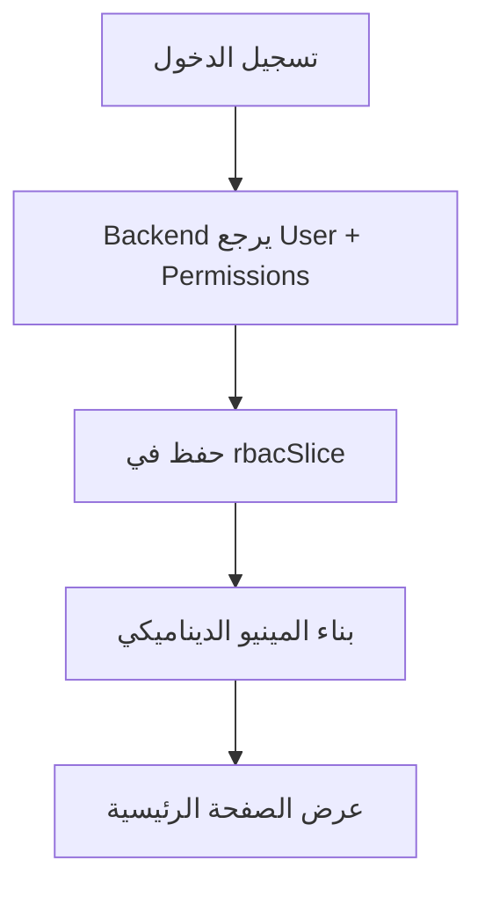
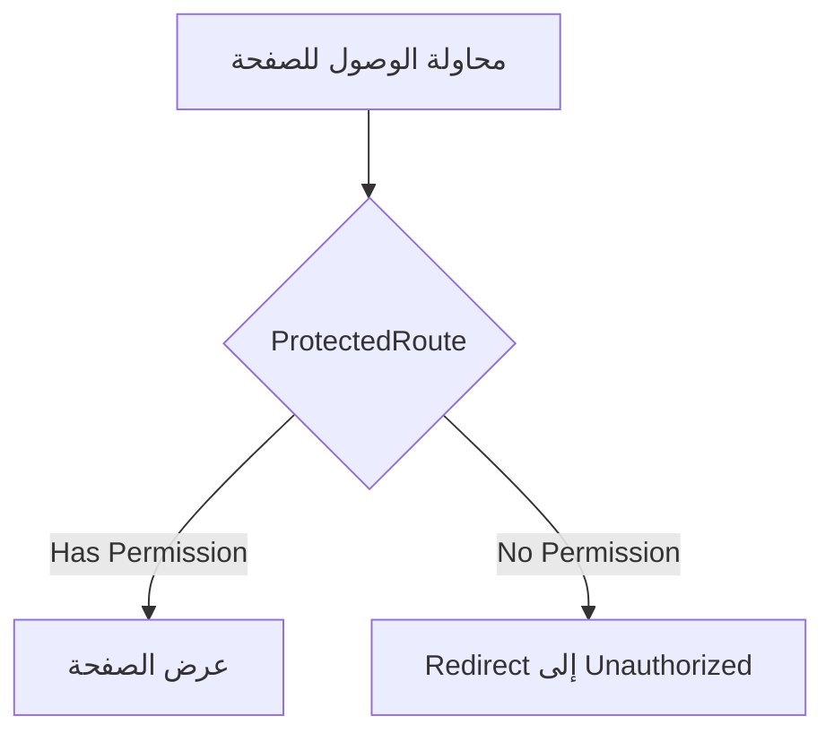
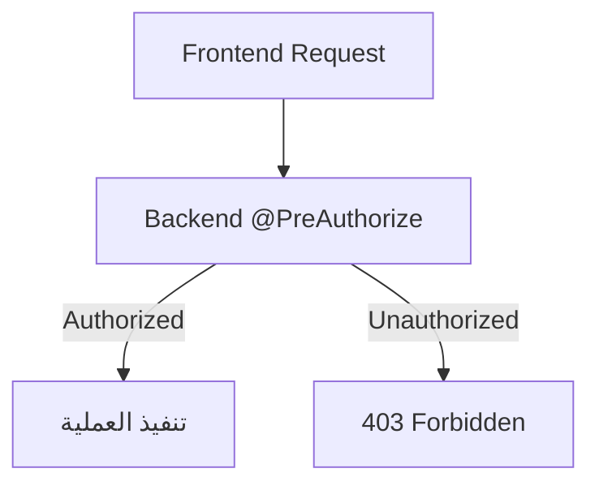

# 📘 دليل المطور - نظام RBAC الاحترافي

## 🎯 نظرة عامة

هذا الدليل يوضح كيفية استخدام وتطوير نظام التحكم بالصلاحيات (RBAC) في نظام TBA WAAD.

---

## 🏗️ البنية المعمارية

### المبدأ الأساسي: Single Source of Truth

```
Backend Permissions = Frontend Menu = Route Access
```

**القاعدة الذهبية:**
- ما يُسمح به في Backend = ما يظهر في المينيو = ما يمكن فتحه فعليًا
- لا استثناءات، لا حلول جزئية

---

## 📦 الملفات الأساسية

### 1. Frontend - نظام الصلاحيات

```
frontend/src/config/
├── rbac.config.js          # تعريف الصلاحيات والأدوار
├── permissions.map.js      # خريطة الصلاحيات التفصيلية
└── route.guards.js         # حماية المسارات
```

### 2. Frontend - المينيو الديناميكي

```
frontend/src/menu-items/
├── components.jsx          # المينيو الديناميكي
└── index.jsx              # نقطة الدخول للمينيو
```

### 3. Store - إدارة الحالة

```
frontend/src/store/
└── rbacSlice.js           # Zustand store للصلاحيات
```

---

## 🔑 نموذج الصلاحيات (Permission Model)

### تعريف الصلاحية

كل صلاحية تتكون من:

```javascript
{
  key: 'VISITS_VIEW',           // المعرف الفريد
  label: 'عرض الزيارات',        // الاسم العربي
  category: 'VISITS',            // التصنيف
  description: 'السماح بعرض...' // الوصف
}
```

### تصنيفات الصلاحيات

| التصنيف | الصلاحيات | الاستخدام |
|---------|-----------|-----------|
| `VISITS` | VIEW, CREATE, UPDATE, DELETE | إدارة الزيارات |
| `CLAIMS` | VIEW, CREATE, UPDATE, DELETE, REVIEW, APPROVE, REJECT | إدارة المطالبات |
| `PREAUTH` | VIEW, CREATE, UPDATE, DELETE, REVIEW, APPROVE, REJECT | الموافقات المسبقة |
| `MEMBERS` | VIEW, CREATE, UPDATE, DELETE | إدارة المؤمن عليهم |
| `DOCUMENTS` | VIEW, UPLOAD, DELETE | إدارة المستندات |
| `REPORTS` | FINANCIAL, PROVIDER, PARTNER, MEDICAL | التقارير |
| `ADMIN` | SYSTEM_SETTINGS, USER_MANAGEMENT, COMPANY_MANAGEMENT | الإدارة |

---

## 👥 الأدوار المعرّفة

### 1️⃣ مقدم الخدمة (SERVICE_PROVIDER)

**الصلاحيات:**
```javascript
[
  'VISITS_VIEW', 'VISITS_CREATE', 'VISITS_UPDATE',
  'CLAIMS_VIEW', 'CLAIMS_CREATE', 'CLAIMS_UPDATE',
  'PREAUTH_VIEW', 'PREAUTH_CREATE', 'PREAUTH_UPDATE',
  'MEMBERS_VIEW',
  'DOCUMENTS_VIEW', 'DOCUMENTS_UPLOAD',
  'PROVIDER_REPORTS', 'PROVIDER_SETTLEMENT'
]
```

**ما يراه:**
- ✅ جميع الوظائف التشغيلية اليومية
- ✅ التقارير الخاصة بمقدم الخدمة
- ❌ الإعدادات الإدارية

---

### 2️⃣ مدير الشريك (PARTNER_MANAGER)

**الصلاحيات:**
```javascript
[
  'VISITS_VIEW',
  'CLAIMS_VIEW',
  'PREAUTH_VIEW',
  'PARTNER_REPORTS'
]
```

**ما يراه:**
- ✅ عرض الزيارات والمطالبات (قراءة فقط)
- ✅ التقارير الخاصة بالشريك
- ❌ إنشاء أو تعديل البيانات
- ❌ الإعدادات

---

### 3️⃣ المراجع الطبي (MEDICAL_REVIEWER)

**الصلاحيات:**
```javascript
[
  'CLAIMS_VIEW', 'CLAIMS_REVIEW', 'CLAIMS_APPROVE', 'CLAIMS_REJECT',
  'PREAUTH_VIEW', 'PREAUTH_REVIEW', 'PREAUTH_APPROVE', 'PREAUTH_REJECT',
  'DOCUMENTS_VIEW',
  'MEDICAL_REPORTS'
]
```

**ما يراه:**
- ✅ مراجعة المطالبات والموافقات
- ✅ المستندات الطبية
- ✅ التقارير الطبية
- ❌ الزيارات
- ❌ المؤمن عليهم
- ❌ العمليات المالية

---

### 4️⃣ المحاسب (ACCOUNTANT)

**الصلاحيات:**
```javascript
[
  'FINANCIAL_REPORTS',
  'PROVIDER_SETTLEMENT',
  'PARTNER_FINANCIAL_REPORTS',
  'CLAIMS_VIEW',      // للتحليل المالي فقط
  'DOCUMENTS_VIEW'    // للمستندات المالية
]
```

**ما يراه:**
- ✅ جميع التقارير المالية
- ✅ التسويات المالية
- ✅ المطالبات (للتحليل فقط)
- ❌ العمليات الطبية
- ❌ إنشاء أو تعديل المطالبات

---

### 5️⃣ مدير النظام (SYSTEM_ADMIN)

**الصلاحيات:**
```javascript
['ALL_PERMISSIONS']  // جميع الصلاحيات
```

**ما يراه:**
- ✅ كل شيء بدون استثناء

---

## 🛠️ دليل الاستخدام للمطورين

### إضافة صفحة جديدة

#### الخطوة 1: تعريف الصلاحية

في `frontend/src/config/permissions.map.js`:

```javascript
export const PERMISSIONS = {
  // ... الصلاحيات الموجودة
  
  INVOICES_VIEW: {
    key: 'INVOICES_VIEW',
    label: 'عرض الفواتير',
    category: 'INVOICES',
    description: 'السماح بعرض قائمة الفواتير'
  },
  INVOICES_CREATE: {
    key: 'INVOICES_CREATE',
    label: 'إنشاء فاتورة',
    category: 'INVOICES',
    description: 'السماح بإنشاء فاتورة جديدة'
  }
};
```

#### الخطوة 2: إضافة الصلاحية للأدوار

في `frontend/src/config/rbac.config.js`:

```javascript
export const ROLE_PERMISSIONS = {
  SERVICE_PROVIDER: [
    // ... الصلاحيات الموجودة
    'INVOICES_VIEW',
    'INVOICES_CREATE'
  ],
  ACCOUNTANT: [
    // ... الصلاحيات الموجودة
    'INVOICES_VIEW'  // قراءة فقط
  ]
};
```

#### الخطوة 3: إضافة عنصر المينيو

في `frontend/src/menu-items/components.jsx`:

```javascript
{
  id: 'invoices',
  title: 'الفواتير',
  type: 'item',
  url: '/provider/invoices',
  icon: icons.IconReceipt,
  breadcrumbs: true,
  permission: 'INVOICES_VIEW'  // ⚠️ مهم جداً
}
```

#### الخطوة 4: إنشاء الصفحة مع Route Guard

في `frontend/src/routes/MainRoutes.jsx`:

```javascript
import ProtectedRoute from '../utils/ProtectedRoute';
import InvoicesPage from '../pages/provider/InvoicesPage';

// داخل routes:
{
  path: 'invoices',
  element: (
    <ProtectedRoute requiredPermission="INVOICES_VIEW">
      <InvoicesPage />
    </ProtectedRoute>
  )
}
```

#### الخطوة 5: حماية API Calls

في الصفحة نفسها:

```javascript
import { useRBAC } from '../store/rbacSlice';

function InvoicesPage() {
  const { hasPermission } = useRBAC();
  
  const canCreate = hasPermission('INVOICES_CREATE');
  const canView = hasPermission('INVOICES_VIEW');

  return (
    <div>
      {canView && <InvoicesList />}
      {canCreate && <Button>إنشاء فاتورة جديدة</Button>}
    </div>
  );
}
```

---

## 🔒 حماية المسارات (Route Guards)

### استخدام ProtectedRoute

```javascript
import ProtectedRoute from '../utils/ProtectedRoute';

// حماية بسيطة - صلاحية واحدة
<ProtectedRoute requiredPermission="VISITS_VIEW">
  <VisitsPage />
</ProtectedRoute>

// حماية متقدمة - صلاحيات متعددة (OR)
<ProtectedRoute requiredPermissions={['CLAIMS_VIEW', 'CLAIMS_REVIEW']}>
  <ClaimsPage />
</ProtectedRoute>

// حماية متقدمة - صلاحيات متعددة (AND)
<ProtectedRoute 
  requiredPermissions={['CLAIMS_VIEW', 'CLAIMS_APPROVE']}
  requireAll={true}
>
  <ClaimsApprovalPage />
</ProtectedRoute>
```

### التحقق البرمجي من الصلاحيات

```javascript
import { useRBAC } from '../store/rbacSlice';

function MyComponent() {
  const { hasPermission, hasAnyPermission, hasAllPermissions } = useRBAC();

  // صلاحية واحدة
  if (hasPermission('VISITS_CREATE')) {
    // ...
  }

  // أي صلاحية من القائمة
  if (hasAnyPermission(['CLAIMS_VIEW', 'CLAIMS_REVIEW'])) {
    // ...
  }

  // جميع الصلاحيات مطلوبة
  if (hasAllPermissions(['CLAIMS_VIEW', 'CLAIMS_APPROVE'])) {
    // ...
  }

  return <div>...</div>;
}
```

---

## 🧪 الاختبار

### اختبار يدوي

1. افتح Console في المتصفح
2. قم بتحميل ملف الاختبار:

```javascript
// في Console
const script = document.createElement('script');
script.src = '/src/tests/rbac-test-scenarios.js';
document.head.appendChild(script);
```

3. شغل الاختبارات:

```javascript
// اختبار دور معين
testServiceProvider();
testPartnerManager();
testMedicalReviewer();
testAccountant();

// اختبار جميع الأدوار
runAllRBACTests();

// اختبار المستخدم الحالي
testCurrentUser();
```

### معايير القبول

يجب أن تنجح جميع الاختبارات التالية:

- ✅ **اختبار المينيو**: كل دور يرى فقط العناصر المصرح بها
- ✅ **اختبار المسارات**: لا يمكن الوصول لصفحات غير مصرح بها
- ✅ **اختبار API**: الطلبات محمية في Backend
- ✅ **اختبار UX**: لا صفحات فارغة، لا روابط ميتة

---

## 🚨 الأخطاء الشائعة

### ❌ خطأ 1: نسيان permission في المينيو

```javascript
// ❌ خطأ
{
  id: 'settings',
  title: 'الإعدادات',
  url: '/provider/settings'
  // نسينا permission!
}

// ✅ صحيح
{
  id: 'settings',
  title: 'الإعدادات',
  url: '/provider/settings',
  permission: 'SYSTEM_SETTINGS'  // ✓
}
```

### ❌ خطأ 2: Hardcoding حسب role

```javascript
// ❌ خطأ
if (user.role === 'SERVICE_PROVIDER') {
  // عرض المينيو
}

// ✅ صحيح
if (hasPermission('VISITS_VIEW')) {
  // عرض المينيو
}
```

### ❌ خطأ 3: إخفاء CSS فقط

```javascript
// ❌ خطأ
<div className={user.role === 'ADMIN' ? 'visible' : 'hidden'}>
  <SettingsButton />
</div>

// ✅ صحيح
{hasPermission('SYSTEM_SETTINGS') && (
  <SettingsButton />
)}
```

### ❌ خطأ 4: عدم حماية المسار

```javascript
// ❌ خطأ
{
  path: 'settings',
  element: <SettingsPage />  // لا حماية!
}

// ✅ صحيح
{
  path: 'settings',
  element: (
    <ProtectedRoute requiredPermission="SYSTEM_SETTINGS">
      <SettingsPage />
    </ProtectedRoute>
  )
}
```

---

## 📊 مصفوفة الصلاحيات الكاملة

| الصفحة/الوظيفة | مقدم خدمة | مدير شريك | مراجع طبي | محاسب | مدير نظام |
|----------------|-----------|-----------|-----------|--------|-----------|
| الزيارات (عرض) | ✅ | ✅ | ❌ | ❌ | ✅ |
| الزيارات (إنشاء) | ✅ | ❌ | ❌ | ❌ | ✅ |
| المطالبات (عرض) | ✅ | ✅ | ✅ | ✅ | ✅ |
| المطالبات (إنشاء) | ✅ | ❌ | ❌ | ❌ | ✅ |
| المطالبات (مراجعة) | ❌ | ❌ | ✅ | ❌ | ✅ |
| الموافقات المسبقة (عرض) | ✅ | ✅ | ✅ | ❌ | ✅ |
| الموافقات (مراجعة) | ❌ | ❌ | ✅ | ❌ | ✅ |
| المؤمن عليهم | ✅ | ❌ | ❌ | ❌ | ✅ |
| المستندات | ✅ | ❌ | ✅ | ✅ | ✅ |
| التقارير المالية | ✅ | ❌ | ❌ | ✅ | ✅ |
| التسويات | ✅ | ❌ | ❌ | ✅ | ✅ |
| إعدادات النظام | ❌ | ❌ | ❌ | ❌ | ✅ |
| إدارة المستخدمين | ❌ | ❌ | ❌ | ❌ | ✅ |

---

## 🔄 سير العمل

### عند تسجيل الدخول



### عند التنقل بين الصفحات



### عند استدعاء API



---

## 🎨 أفضل الممارسات

### 1. التسمية

- استخدم `SCREAMING_SNAKE_CASE` للصلاحيات
- كن واضحاً ومحدداً: `CLAIMS_VIEW` أفضل من `VIEW_DATA`
- اتبع النمط: `RESOURCE_ACTION`

### 2. التنظيم

- جمّع الصلاحيات المتعلقة في تصنيف واحد
- احتفظ بـ `permissions.map.js` محدثاً
- وثّق كل صلاحية جديدة

### 3. الأمان

- **دائماً** حمِ المسارات بـ `ProtectedRoute`
- **دائماً** تحقق من الصلاحيات في Backend
- **لا تعتمد** على frontend فقط

### 4. تجربة المستخدم

- لا تُظهر أزرار لعمليات غير مصرح بها
- اعرض رسائل واضحة عند عدم الصلاحية
- تأكد من عدم وجود صفحات فارغة

---

## 📝 قائمة التحقق (Checklist)

عند إضافة ميزة جديدة:

- [ ] تعريف الصلاحيات في `permissions.map.js`
- [ ] إضافة الصلاحيات للأدوار في `rbac.config.js`
- [ ] إضافة عنصر المينيو مع `permission`
- [ ] حماية المسار بـ `ProtectedRoute`
- [ ] حماية API في Backend
- [ ] اختبار جميع الأدوار
- [ ] توثيق الصلاحيات الجديدة
- [ ] تحديث مصفوفة الصلاحيات

---

## 🆘 الدعم والمساعدة

### مشكلة: المينيو لا يظهر

**الحل:**
1. تحقق من `permission` في تعريف المينيو
2. تحقق من أن المستخدم يملك الصلاحية
3. افتح Console وشغل `testCurrentUser()`

### مشكلة: 403 Forbidden

**الحل:**
1. تحقق من Backend `@PreAuthorize`
2. تحقق من أن الصلاحية موجودة في قاعدة البيانات
3. تحقق من `user.permissions` في Response

### مشكلة: صفحة فارغة

**الحل:**
1. تحقق من `ProtectedRoute` configuration
2. تحقق من `requiredPermission` spelling
3. تحقق من الـ fallback route

---

## 📚 مصادر إضافية

- [API Contract - Role Permissions](./ROLE_PERMISSION_API_CONTRACT.md)
- [Security Notes](./backend/SECURITY_NOTES.md)
- [RBAC System Complete](./PROFESSIONAL_RBAC_SYSTEM_COMPLETE.md)

---

## ✅ ملخص سريع

```javascript
// 1. تعريف الصلاحية
PERMISSIONS.MY_FEATURE_VIEW = { key: 'MY_FEATURE_VIEW', ... }

// 2. إضافة للدور
ROLE_PERMISSIONS.SERVICE_PROVIDER.push('MY_FEATURE_VIEW')

// 3. المينيو
{ permission: 'MY_FEATURE_VIEW', ... }

// 4. المسار
<ProtectedRoute requiredPermission="MY_FEATURE_VIEW">

// 5. Backend
@PreAuthorize("hasAuthority('MY_FEATURE_VIEW')")
```

---

**تم إنشاء هذا الدليل بواسطة:** فريق التطوير  
**آخر تحديث:** 29 يناير 2026  
**الإصدار:** 1.0.0

