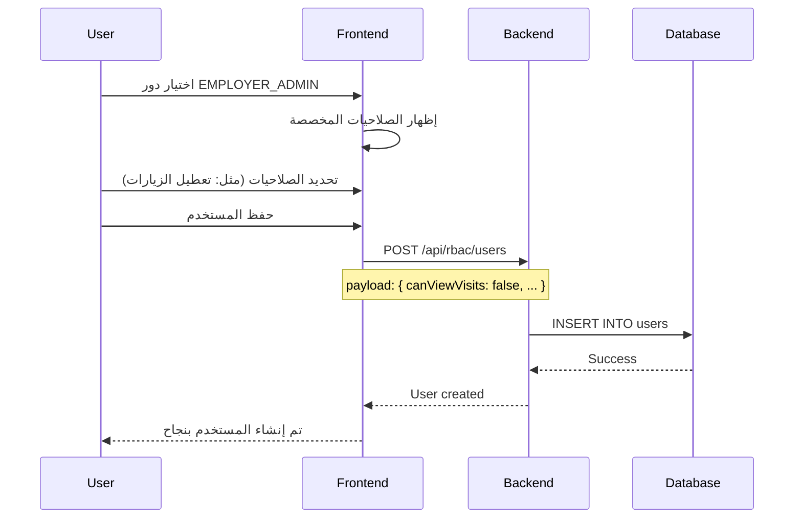
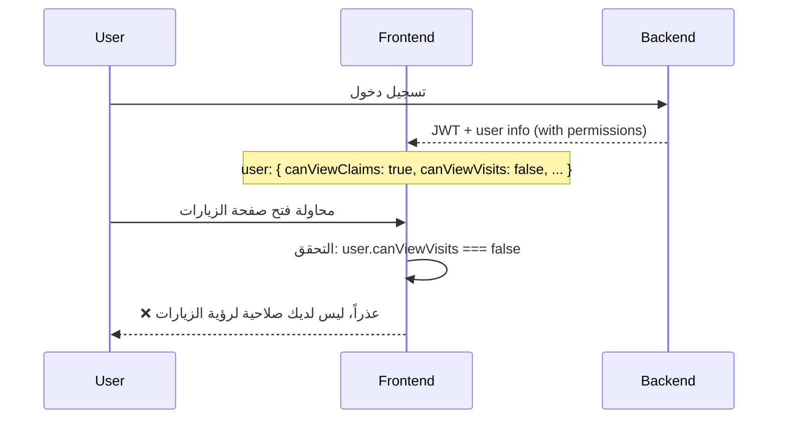

# ✅ نظام الصلاحيات المخصصة لمستخدمي الشركاء

## 📋 نظرة عامة

تم إضافة نظام صلاحيات مرن على مستوى المستخدم لتحديد ما يمكن لكل مستخدم من مستخدمي الشركاء رؤيته وإدارته في النظام.

---

## 🎯 المشكلة التي تم حلها

### قبل التحديث
- **صلاحيات ثابتة على مستوى الدور:** جميع مستخدمي EMPLOYER_ADMIN لديهم نفس الصلاحيات
- **عدم المرونة:** لا يمكن تخصيص الصلاحيات لكل مستخدم على حدة
- **قيود غير مرنة:** إما أن يرى المستخدم كل شيء أو لا يرى شيئاً

### بعد التحديث
- ✅ **صلاحيات مخصصة لكل مستخدم:** يمكن تحديد صلاحيات فريدة لكل مستخدم
- ✅ **تحكم دقيق:** تحديد ما يمكن للمستخدم رؤيته (مطالبات، زيارات، تقارير، إلخ)
- ✅ **مرونة كاملة:** تفعيل/تعطيل كل صلاحية بشكل مستقل

---

## 🔧 الصلاحيات المتاحة

عند إضافة/تعديل مستخدم لديه دور **EMPLOYER_ADMIN** أو **EMPLOYER_USER**، تظهر الصلاحيات التالية:

### 1️⃣ المطالبات (Claims)
- **الحقل:** `canViewClaims`
- **الوصف:** يمكن رؤية وإدارة المطالبات
- **القيمة الافتراضية:** ✅ مُفعّل

### 2️⃣ الزيارات (Visits)
- **الحقل:** `canViewVisits`
- **الوصف:** يمكن رؤية وإدارة الزيارات
- **القيمة الافتراضية:** ✅ مُفعّل

### 3️⃣ التقارير (Reports)
- **الحقل:** `canViewReports`
- **الوصف:** يمكن رؤية التقارير التحليلية
- **القيمة الافتراضية:** ✅ مُفعّل

### 4️⃣ المؤمنين (Members)
- **الحقل:** `canViewMembers`
- **الوصف:** يمكن رؤية وإدارة المؤمنين
- **القيمة الافتراضية:** ✅ مُفعّل

### 5️⃣ وثائق المنافع (Benefit Policies)
- **الحقل:** `canViewBenefitPolicies`
- **الوصف:** يمكن رؤية وثائق التغطية التأمينية
- **القيمة الافتراضية:** ✅ مُفعّل

---

## 🖥️ واجهة المستخدم

### صفحة إنشاء مستخدم جديد
**الملف:** `frontend/src/pages/rbac/users/UserCreate.jsx`

#### التدفق:
1. **الخطوة 1:** معلومات المستخدم الأساسية
2. **الخطوة 2:** تعيين الأدوار
3. **عند اختيار EMPLOYER_ADMIN:**
   - يظهر حقل "معرف الشريك" (Employer ID)
   - تظهر صلاحيات مخصصة مع Switches لكل صلاحية

#### الكود:
```jsx
{hasEmployerAdminRole && (
  <Box sx={{ mt: 3, pt: 2, borderTop: '1px dashed', borderColor: 'warning.main' }}>
    {/* Employer ID */}
    <TextField
      label="معرف الشريك (Employer ID)"
      required
    />
    
    {/* Custom Permissions */}
    <Alert severity="info">
      <Typography variant="body2" fontWeight="medium">
        صلاحيات مخصصة للمستخدم
      </Typography>
    </Alert>
    
    <Grid container spacing={2}>
      <Grid item xs={12} sm={6}>
        <FormControlLabel
          control={<Switch checked={form.canViewClaims} />}
          label="المطالبات"
        />
      </Grid>
      {/* ... other permissions ... */}
    </Grid>
  </Box>
)}
```

---

### صفحة تعديل مستخدم
**الملف:** `frontend/src/pages/rbac/users/UserEdit.jsx`

#### التدفق:
1. **تحميل البيانات:** يتم تحميل الصلاحيات الحالية من Backend
2. **الخطوة 2:** تظهر الصلاحيات المخصصة إذا كان المستخدم لديه دور Employer
3. **الحفظ:** يتم إرسال الصلاحيات المحدثة إلى Backend

#### التحديثات:
```jsx
// Load user data with permissions
setForm({
  ...user,
  canViewClaims: user.canViewClaims !== false,
  canViewVisits: user.canViewVisits !== false,
  canViewReports: user.canViewReports !== false,
  canViewMembers: user.canViewMembers !== false,
  canViewBenefitPolicies: user.canViewBenefitPolicies !== false
});

// Save with permissions
const payload = {
  ...basicFields,
  canViewClaims: form.canViewClaims,
  canViewVisits: form.canViewVisits,
  canViewReports: form.canViewReports,
  canViewMembers: form.canViewMembers,
  canViewBenefitPolicies: form.canViewBenefitPolicies
};
```

---

## 🗄️ قاعدة البيانات

### جدول: `users`

تم إضافة 5 أعمدة جديدة:

```sql
ALTER TABLE users
ADD COLUMN can_view_claims BOOLEAN DEFAULT TRUE,
ADD COLUMN can_view_visits BOOLEAN DEFAULT TRUE,
ADD COLUMN can_view_reports BOOLEAN DEFAULT TRUE,
ADD COLUMN can_view_members BOOLEAN DEFAULT TRUE,
ADD COLUMN can_view_benefit_policies BOOLEAN DEFAULT TRUE;
```

### Migration
**الملف:** `backend/migrations/V1.5__add_custom_employer_permissions.sql`

#### الميزات:
- ✅ إضافة الأعمدة مع `IF NOT EXISTS` (آمن للتشغيل المتكرر)
- ✅ القيمة الافتراضية: `TRUE` (جميع الصلاحيات مُفعّلة)
- ✅ تحديث المستخدمين الحاليين للتوافق مع الإصدارات السابقة
- ✅ استعلام التحقق لمراجعة التغييرات

---

## 🔌 Backend API

### User Entity
**الملف:** `backend/src/main/java/com/waad/tba/modules/rbac/entity/User.java`

```java
// Custom permissions for EMPLOYER users
@Column(name = "can_view_claims")
@Builder.Default
private Boolean canViewClaims = true;

@Column(name = "can_view_visits")
@Builder.Default
private Boolean canViewVisits = true;

@Column(name = "can_view_reports")
@Builder.Default
private Boolean canViewReports = true;

@Column(name = "can_view_members")
@Builder.Default
private Boolean canViewMembers = true;

@Column(name = "can_view_benefit_policies")
@Builder.Default
private Boolean canViewBenefitPolicies = true;
```

### UserCreateDto
**الملف:** `backend/src/main/java/com/waad/tba/modules/rbac/dto/UserCreateDto.java`

```java
// Employer/Provider associations
private Long employerId;
private Long providerId;

// Custom permissions for EMPLOYER users
private Boolean canViewClaims;
private Boolean canViewVisits;
private Boolean canViewReports;
private Boolean canViewMembers;
private Boolean canViewBenefitPolicies;
```

### UserUpdateDto
**الملف:** `backend/src/main/java/com/waad/tba/modules/rbac/dto/UserUpdateDto.java`

```java
// Custom permissions for EMPLOYER users
private Boolean canViewClaims;
private Boolean canViewVisits;
private Boolean canViewReports;
private Boolean canViewMembers;
private Boolean canViewBenefitPolicies;
```

---

## 📊 تدفق البيانات

### إنشاء مستخدم جديد



### تسجيل الدخول والتحقق من الصلاحيات



---

## 🎨 تجربة المستخدم

### السيناريو 1: مستخدم لديه جميع الصلاحيات
**المستخدم:** أحمد (EMPLOYER_ADMIN لشريك XYZ)

**الصلاحيات:**
- ✅ المطالبات
- ✅ الزيارات
- ✅ التقارير
- ✅ المؤمنين
- ✅ وثائق المنافع

**النتيجة:**
- يمكنه الوصول إلى جميع القوائم والصفحات
- تجربة كاملة بدون قيود

---

### السيناريو 2: مستخدم بصلاحيات محدودة
**المستخدم:** فاطمة (EMPLOYER_ADMIN لشريك ABC)

**الصلاحيات:**
- ✅ المطالبات
- ❌ الزيارات (مُعطّل)
- ✅ التقارير
- ✅ المؤمنين
- ❌ وثائق المنافع (مُعطّل)

**النتيجة:**
- يمكنها رؤية المطالبات والتقارير والمؤمنين
- **لا يمكنها** الوصول إلى صفحات الزيارات ووثائق المنافع
- رسالة واضحة: "ليس لديك صلاحية للوصول إلى هذه الصفحة"

---

## 🔒 الأمان

### 1. التحقق في Frontend
```jsx
// في كل صفحة محمية
const { user } = useAuth();

if (user.role === 'EMPLOYER_ADMIN' && !user.canViewClaims) {
  return <AccessDenied message="ليس لديك صلاحية لرؤية المطالبات" />;
}
```

### 2. التحقق في Backend
```java
// في كل Controller
@PreAuthorize("hasAuthority('VIEW_CLAIMS')")
public ResponseEntity<?> getClaims(@AuthenticationPrincipal UserDetails user) {
    User currentUser = userRepository.findByUsername(user.getUsername());
    
    // Additional check for EMPLOYER users
    if (currentUser.getEmployerId() != null && !currentUser.getCanViewClaims()) {
        throw new AccessDeniedException("You don't have permission to view claims");
    }
    
    // ... rest of the logic
}
```

---

## ✅ الاختبار

### خطوات الاختبار

#### 1. إنشاء مستخدم جديد
1. افتح صفحة إنشاء مستخدم: `/rbac/users/create`
2. أدخل البيانات الأساسية
3. اختر دور **EMPLOYER_ADMIN**
4. تحقق من ظهور حقل "معرف الشريك" والصلاحيات
5. عطّل صلاحية "الزيارات"
6. احفظ المستخدم

#### 2. تسجيل الدخول والتحقق
1. سجّل الخروج من الحساب الحالي
2. سجّل الدخول بالمستخدم الجديد
3. حاول فتح صفحة الزيارات
4. تحقق من ظهور رسالة "ليس لديك صلاحية"
5. افتح صفحة المطالبات
6. تحقق من الوصول الناجح

#### 3. تعديل الصلاحيات
1. سجّل الدخول كـ SUPER_ADMIN
2. افتح صفحة تعديل المستخدم
3. فعّل صلاحية "الزيارات"
4. احفظ التغييرات
5. سجّل الدخول مرة أخرى بالمستخدم
6. تحقق من إمكانية الوصول لصفحة الزيارات الآن

---

## 📁 الملفات المحدثة

### Backend (4 ملفات)
1. ✅ `User.java` - إضافة حقول الصلاحيات
2. ✅ `UserCreateDto.java` - إضافة حقول في DTO الإنشاء
3. ✅ `UserUpdateDto.java` - إضافة حقول في DTO التحديث
4. ✅ `V1.5__add_custom_employer_permissions.sql` - Migration SQL

### Frontend (2 ملفات)
1. ✅ `UserCreate.jsx` - UI للصلاحيات في صفحة الإنشاء
2. ✅ `UserEdit.jsx` - UI للصلاحيات في صفحة التعديل

---

## 🚀 التحسينات المستقبلية

### قصيرة المدى
- [ ] إضافة صلاحيات على مستوى الإجراءات (Create, Update, Delete بدلاً من View فقط)
- [ ] إضافة Role Template (قوالب جاهزة للصلاحيات)
- [ ] Audit Log لتتبع تغييرات الصلاحيات

### متوسطة المدى
- [ ] صلاحيات على مستوى البيانات (Data-level permissions)
- [ ] صلاحيات زمنية (Time-based permissions)
- [ ] Approval workflow لتغيير الصلاحيات

### طويلة المدى
- [ ] نظام ABAC (Attribute-Based Access Control)
- [ ] Context-aware permissions
- [ ] Machine learning لاقتراح الصلاحيات المناسبة

---

## 📝 ملاحظات مهمة

### 1. التوافق مع الإصدارات السابقة
- ✅ جميع المستخدمين الحاليين يحصلون على جميع الصلاحيات افتراضياً
- ✅ لا حاجة لتحديث المستخدمين الحاليين يدوياً

### 2. القيم الافتراضية
- جميع الصلاحيات مُفعّلة افتراضياً (`TRUE`)
- يمكن تعطيل أي صلاحية عند الحاجة

### 3. نطاق التطبيق
- الصلاحيات المخصصة تظهر فقط لأدوار **EMPLOYER**
- الأدوار الأخرى (SUPER_ADMIN, ADMIN, etc.) لا تتأثر

---

## ✅ الحالة النهائية

**🎉 تم تطبيق نظام الصلاحيات المخصصة بنجاح!**

| المكون | الحالة |
|--------|--------|
| Backend Entity | ✅ مكتمل |
| Backend DTOs | ✅ مكتمل |
| Database Migration | ✅ مكتمل |
| Frontend Create UI | ✅ مكتمل |
| Frontend Edit UI | ✅ مكتمل |
| التوثيق | ✅ مكتمل |

---

**تاريخ الإكمال:** 2026-01-05  
**المطور:** GitHub Copilot
