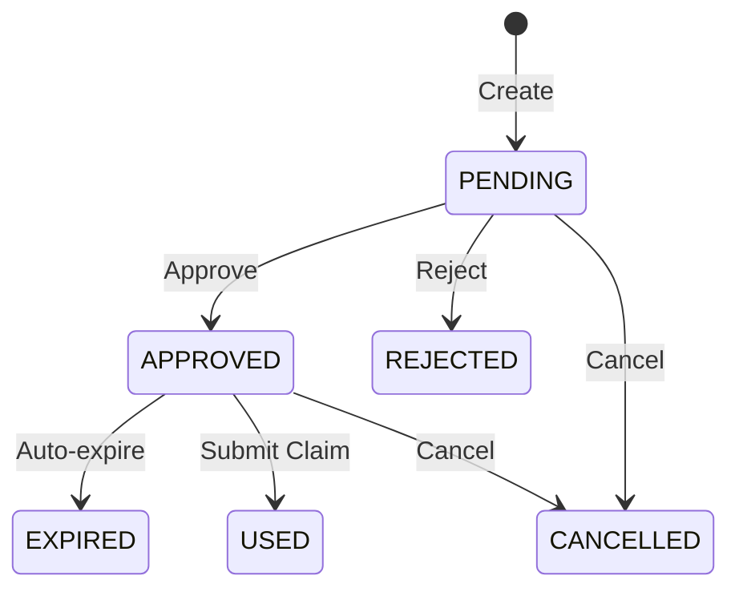

# 📜 PreAuthorization API Contract

**Module:** PreAuthorization (موافقات مسبقة)  
**Status:** ✅ Backend Complete - Frontend Integration Needed  
**Version:** 1.0.0  
**Date:** 2025-12-31  
**Auto-Code Pattern:** `PA-YYYYMMDD-XXXXX`

---

## 🎯 Purpose

هذا المستند يُعرّف **العقد الكامل لـ API الموافقات المسبقة** (Pre-Authorization). يشمل:
- جميع نقاط النهاية (Endpoints)
- طلبات واستجابات DTOs
- سير عمل الحالات (Status Workflow)
- قواعد العمل (Business Rules)
- نقاط التكامل (Integration Points)
- رموز الأخطاء (Error Codes)
- متطلبات الصلاحيات (Permissions)

---

## 📐 Architecture Overview

```
Member Request → Provider → PreAuthorization → Coverage Check
                                    ↓
                         Contract Price Lookup
                                    ↓
                         Approval/Rejection Decision
                                    ↓
                         Valid PreAuth → Claim Submission
```

### Integration Points:
```
PreAuthorization
    ├─► Member (eligibility validation)
    ├─► Provider (active provider validation)
    ├─► BenefitPolicy (coverage calculation)
    ├─► ProviderContract (price lookup)
    ├─► MedicalService (service validation)
    └─► Claim (pre-auth linking)
```

---

## 📋 Field Registry

### Core Fields

| Field Name | Arabic | Type | Required | Validation | Notes |
|------------|--------|------|----------|------------|-------|
| **referenceNumber** | رقم المرجع | String(50) | ✔️ Auto | Unique, Format: PA-YYYYMMDD-XXXXX | System-generated |
| **memberId** | رقم العضو | Long | ✔️ Yes | Positive, Exists | Foreign key to members |
| **providerId** | رقم المقدم | Long | ✔️ Yes | Positive, Exists | Foreign key to providers |
| **serviceCode** | كود الخدمة | String(50) | ✔️ Yes | Max 50 chars, Exists | Foreign key to medical_services |
| **requestDate** | تاريخ الطلب | LocalDate | ✔️ Yes | FutureOrPresent | When service is planned |
| **expiryDate** | تاريخ الانتهاء | LocalDate | ✔️ Auto | requestDate + expiryDays | Default: +30 days |
| **requestedAmount** | المبلغ المطلوب | BigDecimal(10,2) | ✔️ Yes | > 0 | Provider's requested amount |
| **contractPrice** | سعر العقد | BigDecimal(10,2) | ❌ Auto | ≥ 0 | From ProviderContract (if exists) |
| **approvedAmount** | المبلغ الموافق عليه | BigDecimal(10,2) | ❌ No | ≥ 0 | Set on approval |
| **copayAmount** | تحمل المريض | BigDecimal(10,2) | ❌ Auto | ≥ 0 | Calculated on approval |
| **copayPercentage** | نسبة التحمل | BigDecimal(5,2) | ❌ No | 0-100 | From policy or custom |
| **insuranceCoveredAmount** | المبلغ المغطى | BigDecimal(10,2) | ❌ Auto | ≥ 0 | approvedAmount - copayAmount |
| **currency** | العملة | String(3) | ❌ No | ISO 4217 | Default: "LYD" |
| **status** | الحالة | Enum | ✔️ Auto | See Status Workflow | PENDING, APPROVED, etc. |
| **priority** | الأولوية | Enum | ❌ No | See Priority Enum | EMERGENCY, URGENT, NORMAL, LOW |
| **diagnosis** | التشخيص | String(500) | ❌ No | Max 500 chars | Medical diagnosis |
| **notes** | ملاحظات | String(1000) | ❌ No | Max 1000 chars | Additional notes |
| **rejectionReason** | سبب الرفض | String(500) | ❌ No | Max 500 chars | Required on rejection |

### Audit Fields (System-Managed)

| Field | Type | Required | Immutable | Owner |
|-------|------|----------|-----------|-------|
| **id** | Long | ✔️ Auto | ✔️ Yes | System |
| **createdAt** | LocalDateTime | ✔️ Auto | ✔️ Yes | System |
| **updatedAt** | LocalDateTime | ✔️ Auto | ❌ No | System |
| **createdBy** | String(100) | ✔️ Auto | ✔️ Yes | System |
| **updatedBy** | String(100) | ❌ Auto | ❌ No | System |
| **approvedAt** | LocalDateTime | ❌ Auto | ❌ No | System |
| **approvedBy** | String(100) | ❌ Auto | ❌ No | System |
| **active** | Boolean | ✔️ Auto | ❌ No | System |

---

## 📊 Status Workflow

### Status Enum

```java
public enum PreAuthStatus {
    PENDING,      // قيد الانتظار - awaiting review
    APPROVED,     // موافق عليه - approved and valid
    REJECTED,     // مرفوض - rejected with reason
    EXPIRED,      // منتهي الصلاحية - expired without use
    CANCELLED,    // ملغي - cancelled by user
    USED          // مستخدم - already used in a claim
}
```

### Priority Enum

```java
public enum Priority {
    EMERGENCY,    // طارئ - emergency cases (immediate)
    URGENT,       // عاجل - urgent cases (24-48h)
    NORMAL,       // عادي - normal priority (default)
    LOW           // منخفض - low priority
}
```

### State Transitions



### Transition Rules

| From State | To State | Permission | Conditions |
|------------|----------|------------|------------|
| `null` | PENDING | CREATE_PRE_AUTH | Valid member, provider, service |
| PENDING | APPROVED | APPROVE_PRE_AUTH | approvedAmount > 0 |
| PENDING | REJECTED | REJECT_PRE_AUTH | rejectionReason required |
| PENDING | CANCELLED | CANCEL_PRE_AUTH | active = true |
| APPROVED | EXPIRED | SYSTEM | expiryDate < today |
| APPROVED | USED | SYSTEM | Claim submitted |
| APPROVED | CANCELLED | CANCEL_PRE_AUTH | active = true |

---

## 🔌 API Endpoints

### Base URL
```
/api/pre-authorizations
```

---

### 1. Create PreAuthorization

**Endpoint:** `POST /api/pre-authorizations`  
**Permission:** `CREATE_PRE_AUTH`  
**Description:** إنشاء موافقة مسبقة جديدة مع فحص سعر العقد تلقائياً

#### Request DTO

```java
{
  "memberId": 123,                    // Required
  "providerId": 456,                  // Required
  "serviceCode": "MRI-001",           // Required
  "requestDate": "2025-01-15",        // Required (today or future)
  "requestedAmount": 500.00,          // Required (> 0)
  "currency": "LYD",                  // Optional (default: LYD)
  "priority": "URGENT",               // Optional (EMERGENCY, URGENT, NORMAL, LOW)
  "diagnosis": "Suspected fracture",  // Optional (max 500 chars)
  "notes": "Patient in pain",         // Optional (max 1000 chars)
  "expiryDays": 30                    // Optional (default: 30)
}
```

#### Response (201 CREATED)

```json
{
  "success": true,
  "message": "Pre-authorization created successfully",
  "data": {
    "id": 789,
    "referenceNumber": "PA-20250115-00123",
    
    // Member details
    "memberId": 123,
    "memberName": "أحمد محمد علي",
    "memberCardNumber": "WAAD|MEMBER|000123",
    
    // Provider details
    "providerId": 456,
    "providerName": "مستشفى الواحة",
    "providerLicense": "PRV-001",
    
    // Service details
    "serviceCode": "MRI-001",
    "serviceName": "تصوير بالرنين المغناطيسي",
    "serviceNameEn": "MRI Scan",
    
    // Dates
    "requestDate": "2025-01-15",
    "expiryDate": "2025-02-14",
    "daysUntilExpiry": 30,
    
    // Amounts
    "requestedAmount": 500.00,
    "contractPrice": 450.00,          // From ProviderContract (if found)
    "approvedAmount": null,           // Set on approval
    "copayAmount": null,
    "copayPercentage": null,
    "insuranceCoveredAmount": null,
    "currency": "LYD",
    
    // Status
    "status": "PENDING",
    "priority": "URGENT",
    
    // Additional info
    "diagnosis": "Suspected fracture",
    "notes": "Patient in pain",
    "rejectionReason": null,
    
    // Flags
    "hasContract": true,              // Contract found for provider+service
    "isValid": false,                 // Not yet approved
    "isExpired": false,
    "canBeApproved": true,            // Status = PENDING
    "canBeRejected": true,
    "canBeCancelled": true,
    
    // Audit
    "createdAt": "2025-01-15T10:30:00",
    "updatedAt": "2025-01-15T10:30:00",
    "createdBy": "ahmad.ali",
    "updatedBy": null,
    "approvedAt": null,
    "approvedBy": null,
    "active": true
  }
}
```

#### Validation Rules

1. ✅ Member must exist and be active
2. ✅ Provider must exist and be active
3. ✅ Service must exist and be active
4. ✅ requestDate >= today
5. ✅ requestedAmount > 0
6. ⚠️ Warning if requestedAmount > contractPrice
7. ℹ️ Info if service doesn't require PA

#### Business Logic

```java
1. Validate member (exists, active)
2. Validate provider (exists, active)
3. Validate service (exists, active)
4. Check if service requires PA (warn if not)
5. Get contract price from ProviderContract
   - Call: providerContractService.getEffectivePrice(providerId, serviceCode, requestDate)
   - If found: set contractPrice
   - If not found: log warning
6. Generate unique referenceNumber (PA-YYYYMMDD-XXXXX)
7. Calculate expiryDate (requestDate + expiryDays)
8. Create PreAuthorization with status = PENDING
9. Save to database
10. Log audit trail
11. Return response DTO
```

---

### 2. Update PreAuthorization

**Endpoint:** `PUT /api/pre-authorizations/{id}`  
**Permission:** `UPDATE_PRE_AUTH`  
**Description:** تحديث موافقة مسبقة (فقط إذا كانت PENDING)

#### Request DTO

```json
{
  "requestedAmount": 550.00,          // Optional
  "priority": "EMERGENCY",            // Optional
  "diagnosis": "Confirmed fracture",  // Optional
  "notes": "Updated diagnosis",       // Optional
  "expiryDays": 45                    // Optional (recalculates expiryDate)
}
```

#### Response (200 OK)

```json
{
  "success": true,
  "message": "Pre-authorization updated successfully",
  "data": { /* Same as Create Response */ }
}
```

#### Constraints

- ❌ Can only update if `status = PENDING`
- ❌ Can only update if `active = true`
- ✅ All fields are optional (update only what's provided)

---

### 3. Approve PreAuthorization

**Endpoint:** `POST /api/pre-authorizations/{id}/approve`  
**Permission:** `APPROVE_PRE_AUTH`  
**Description:** الموافقة على طلب موافقة مسبقة وحساب التحمل

#### Request DTO

```json
{
  "approvedAmount": 450.00,           // Required (> 0)
  "copayPercentage": 20.0,            // Optional (0-100, from policy or custom)
  "approvalNotes": "Approved as per contract price"  // Optional (max 1000)
}
```

#### Response (200 OK)

```json
{
  "success": true,
  "message": "Pre-authorization approved successfully",
  "data": {
    "id": 789,
    "referenceNumber": "PA-20250115-00123",
    "status": "APPROVED",
    "approvedAmount": 450.00,
    "copayAmount": 90.00,              // 450 * 20% = 90
    "copayPercentage": 20.0,
    "insuranceCoveredAmount": 360.00,  // 450 - 90 = 360
    "approvedAt": "2025-01-15T14:20:00",
    "approvedBy": "reviewer.user",
    "isValid": true,
    "canBeApproved": false,            // Already approved
    // ... other fields
  }
}
```

#### Business Logic

```java
1. Validate preAuth exists and active
2. Check status = PENDING (throw error if not)
3. Validate approvedAmount > 0
4. Calculate copayAmount:
   - copayAmount = approvedAmount * (copayPercentage / 100)
   - Round to 2 decimals
5. Calculate insuranceCoveredAmount:
   - insuranceCoveredAmount = approvedAmount - copayAmount
6. Update status = APPROVED
7. Set approvedAt = now()
8. Set approvedBy = current user
9. Append approvalNotes to notes
10. Save to database
11. Log audit trail
12. Return response DTO
```

---

### 4. Reject PreAuthorization

**Endpoint:** `POST /api/pre-authorizations/{id}/reject`  
**Permission:** `REJECT_PRE_AUTH`  
**Description:** رفض طلب موافقة مسبقة مع ذكر السبب

#### Request DTO

```json
{
  "rejectionReason": "Service not covered by policy"  // Required (max 500)
}
```

#### Response (200 OK)

```json
{
  "success": true,
  "message": "Pre-authorization rejected",
  "data": {
    "id": 789,
    "status": "REJECTED",
    "rejectionReason": "Service not covered by policy",
    "isValid": false,
    "canBeApproved": false,
    "canBeRejected": false,
    // ... other fields
  }
}
```

---

### 5. Cancel PreAuthorization

**Endpoint:** `POST /api/pre-authorizations/{id}/cancel`  
**Permission:** `CANCEL_PRE_AUTH`  
**Description:** إلغاء موافقة مسبقة (PENDING أو APPROVED)

#### Request Parameters

```
?reason=Patient cancelled appointment
```

#### Response (200 OK)

```json
{
  "success": true,
  "message": "Pre-authorization cancelled",
  "data": {
    "id": 789,
    "status": "CANCELLED",
    "notes": "Original notes\nCancelled: Patient cancelled appointment",
    "canBeCancelled": false,
    // ... other fields
  }
}
```

---

### 6. Delete PreAuthorization (Soft Delete)

**Endpoint:** `DELETE /api/pre-authorizations/{id}`  
**Permission:** `DELETE_PRE_AUTH`  
**Description:** حذف ناعم للموافقة المسبقة (soft delete)

#### Response (200 OK)

```json
{
  "success": true,
  "message": "Pre-authorization deleted successfully",
  "data": null
}
```

#### Business Logic

```java
1. Set active = false
2. Set updatedBy = current user
3. Save to database
4. Log audit trail
```

---

### 7. Get PreAuthorization by ID

**Endpoint:** `GET /api/pre-authorizations/{id}`  
**Permission:** `VIEW_PRE_AUTH`

#### Response (200 OK)

```json
{
  "success": true,
  "data": { /* Full PreAuthorizationResponseDto */ }
}
```

---

### 8. Get PreAuthorization by Reference

**Endpoint:** `GET /api/pre-authorizations/reference/{referenceNumber}`  
**Permission:** `VIEW_PRE_AUTH`

#### Example

```
GET /api/pre-authorizations/reference/PA-20250115-00123
```

#### Response (200 OK)

```json
{
  "success": true,
  "data": { /* Full PreAuthorizationResponseDto */ }
}
```

---

### 9. Get PreAuthorizations by Member

**Endpoint:** `GET /api/pre-authorizations/member/{memberId}`  
**Permission:** `VIEW_PRE_AUTH`  
**Description:** قائمة الموافقات المسبقة لعضو معين

#### Request Parameters

```
?page=0&size=20&sortBy=createdAt&sortDirection=DESC
```

#### Response (200 OK)

```json
{
  "content": [
    { /* PreAuthorizationResponseDto */ },
    { /* PreAuthorizationResponseDto */ }
  ],
  "page": 0,
  "size": 20,
  "totalElements": 45,
  "totalPages": 3,
  "first": true,
  "last": false
}
```

---

### 10. Get PreAuthorizations by Provider

**Endpoint:** `GET /api/pre-authorizations/provider/{providerId}`  
**Permission:** `VIEW_PRE_AUTH`

#### Request Parameters

```
?page=0&size=20&sortBy=createdAt&sortDirection=DESC
```

---

### 11. Get PreAuthorizations by Status

**Endpoint:** `GET /api/pre-authorizations/status/{status}`  
**Permission:** `VIEW_PRE_AUTH`

#### Example

```
GET /api/pre-authorizations/status/PENDING?page=0&size=20
```

#### Valid Status Values

```
PENDING, APPROVED, REJECTED, EXPIRED, CANCELLED, USED
```

---

### 12. Find Valid PreAuthorization (for Claim)

**Endpoint:** `GET /api/pre-authorizations/valid`  
**Permission:** `VIEW_PRE_AUTH`  
**Description:** البحث عن موافقة مسبقة صالحة عند تقديم مطالبة

#### Request Parameters

```
?memberId=123&providerId=456&serviceCode=MRI-001
```

#### Response (200 OK)

```json
{
  "success": true,
  "data": {
    "id": 789,
    "status": "APPROVED",
    "isValid": true,
    "isExpired": false,
    // ... full response
  }
}
```

#### Response (404 NOT FOUND)

```json
{
  "success": false,
  "message": "No valid pre-authorization found for this member, provider and service",
  "errorCode": "PRE_AUTH_NOT_FOUND"
}
```

#### Search Logic

```java
1. Find PreAuthorization where:
   - memberId = {memberId}
   - providerId = {providerId}
   - serviceCode = {serviceCode}
   - status = APPROVED
   - active = true
   - expiryDate >= today (or null)
   - Order by createdAt DESC
2. Return first match (most recent)
3. If not found, throw ResourceNotFoundException
```

---

### 13. Maintenance: Mark Expired PreAuthorizations

**Endpoint:** `POST /api/pre-authorizations/maintenance/mark-expired`  
**Permission:** `ADMIN`  
**Description:** تحديث الموافقات المنتهية تلقائياً (Scheduled Job)

#### Response (200 OK)

```json
{
  "success": true,
  "message": "Marked 12 pre-authorizations as expired",
  "data": 12
}
```

#### Business Logic

```java
1. Find all PreAuthorizations where:
   - status = APPROVED
   - active = true
   - expiryDate < today
2. For each:
   - Set status = EXPIRED
   - Set updatedAt = now()
3. Return count of updated records
```

---

## 🔒 Permissions Matrix

| Endpoint | Permission | Roles |
|----------|------------|-------|
| POST /api/pre-authorizations | CREATE_PRE_AUTH | PROVIDER, EMPLOYER, ADMIN |
| PUT /api/pre-authorizations/{id} | UPDATE_PRE_AUTH | PROVIDER, ADMIN |
| POST /api/pre-authorizations/{id}/approve | APPROVE_PRE_AUTH | REVIEWER, INSURANCE, ADMIN |
| POST /api/pre-authorizations/{id}/reject | REJECT_PRE_AUTH | REVIEWER, INSURANCE, ADMIN |
| POST /api/pre-authorizations/{id}/cancel | CANCEL_PRE_AUTH | PROVIDER, MEMBER, ADMIN |
| DELETE /api/pre-authorizations/{id} | DELETE_PRE_AUTH | ADMIN |
| GET /api/pre-authorizations/{id} | VIEW_PRE_AUTH | ALL_AUTHENTICATED |
| GET /api/pre-authorizations/reference/{ref} | VIEW_PRE_AUTH | ALL_AUTHENTICATED |
| GET /api/pre-authorizations/member/{id} | VIEW_PRE_AUTH | ALL_AUTHENTICATED |
| GET /api/pre-authorizations/provider/{id} | VIEW_PRE_AUTH | ALL_AUTHENTICATED |
| GET /api/pre-authorizations/status/{status} | VIEW_PRE_AUTH | ALL_AUTHENTICATED |
| GET /api/pre-authorizations/valid | VIEW_PRE_AUTH | ALL_AUTHENTICATED |
| POST /api/pre-authorizations/maintenance/mark-expired | ADMIN | ADMIN, SYSTEM |

---

## ⚠️ Error Codes

| Code | HTTP Status | Message (AR) | Message (EN) | When |
|------|-------------|--------------|--------------|------|
| **PRE_AUTH_NOT_FOUND** | 404 | الموافقة المسبقة غير موجودة | PreAuthorization not found | ID/Reference not found |
| **MEMBER_NOT_FOUND** | 404 | العضو غير موجود | Member not found | Invalid memberId |
| **PROVIDER_NOT_FOUND** | 404 | مقدم الخدمة غير موجود | Provider not found | Invalid providerId |
| **SERVICE_NOT_FOUND** | 404 | الخدمة الطبية غير موجودة | Medical service not found | Invalid serviceCode |
| **MEMBER_NOT_ACTIVE** | 400 | العضو غير نشط | Member is not active | Member.active = false |
| **PROVIDER_NOT_ACTIVE** | 400 | مقدم الخدمة غير نشط | Provider is not active | Provider.active = false |
| **SERVICE_NOT_ACTIVE** | 400 | الخدمة الطبية غير نشطة | Medical service is not active | Service.active = false |
| **INVALID_STATUS_TRANSITION** | 400 | انتقال حالة غير صالح | Invalid status transition | Status transition not allowed |
| **CANNOT_UPDATE_STATUS** | 400 | لا يمكن تحديث هذه الحالة | Cannot update this status | Status != PENDING |
| **INVALID_AMOUNT** | 400 | مبلغ غير صالح | Invalid amount | Amount <= 0 |
| **AMOUNT_EXCEEDS_CONTRACT** | 400 | المبلغ يتجاوز سعر العقد | Amount exceeds contract price | Warning, not error |
| **NO_CONTRACT_FOUND** | 400 | لا يوجد عقد مع المقدم | No contract found with provider | Info, not error |
| **REJECTION_REASON_REQUIRED** | 400 | سبب الرفض مطلوب | Rejection reason is required | Reject without reason |
| **INVALID_DATE** | 400 | تاريخ غير صالح | Invalid date | requestDate in past |
| **DUPLICATE_REFERENCE** | 409 | رقم المرجع مكرر | Duplicate reference number | Unique constraint violation |
| **VALIDATION_ERROR** | 400 | خطأ في التحقق | Validation error | DTO validation failed |
| **ACCESS_DENIED** | 403 | الوصول مرفوض | Access denied | Permission check failed |

---

## 🔗 Integration Points

### 1. Member Module

**Purpose:** التحقق من أهلية العضو  
**Used In:** `createPreAuthorization()`

```java
// 1. Validate member exists
Member member = memberRepository.findById(memberId)
    .orElseThrow(() -> new ResourceNotFoundException("Member not found"));

// 2. Check member is active
if (!member.getActive()) {
    throw new IllegalArgumentException("Member is not active");
}

// 3. Get member details for response
response.setMemberId(member.getId());
response.setMemberName(member.getFullNameArabic());
response.setMemberCardNumber(member.getCardNumber());
```

---

### 2. Provider Module

**Purpose:** التحقق من مقدم الخدمة  
**Used In:** `createPreAuthorization()`

```java
// 1. Validate provider exists
Provider provider = providerRepository.findById(providerId)
    .orElseThrow(() -> new ResourceNotFoundException("Provider not found"));

// 2. Check provider is active
if (!provider.getActive()) {
    throw new IllegalArgumentException("Provider is not active");
}

// 3. Get provider details for response
response.setProviderId(provider.getId());
response.setProviderName(provider.getName());
response.setProviderLicense(provider.getLicenseNumber());
```

---

### 3. MedicalTaxonomy Module

**Purpose:** التحقق من صحة الخدمة الطبية  
**Used In:** `createPreAuthorization()`

```java
// 1. Validate service exists
MedicalService service = medicalServiceRepository.findByCode(serviceCode)
    .orElseThrow(() -> new ResourceNotFoundException("Service not found"));

// 2. Check service is active
if (!service.isActive()) {
    throw new IllegalArgumentException("Service is not active");
}

// 3. Check if service requires PA (warning only)
if (!service.isRequiresPA()) {
    log.warn("Service {} does not require pre-authorization", serviceCode);
}

// 4. Get service details for response
response.setServiceCode(service.getCode());
response.setServiceName(service.getName());
response.setServiceNameEn(service.getNameEn());
```

---

### 4. ProviderContract Module ⭐ (KEY INTEGRATION)

**Purpose:** الحصول على سعر العقد لحساب التغطية  
**Used In:** `createPreAuthorization()`

```java
// 1. Call ProviderContract service
EffectivePriceResponseDto priceResponse = providerContractService.getEffectivePrice(
    providerId,
    serviceCode,
    requestDate
);

// 2. Check if contract found
if (priceResponse.isHasContract()) {
    // 2a. Set contract price
    contractPrice = priceResponse.getContractPrice();
    response.setHasContract(true);
    
    // 2b. Compare with requested amount (warning if exceeds)
    if (requestedAmount.compareTo(contractPrice) > 0) {
        log.warn("Requested amount {} exceeds contract price {}", 
                 requestedAmount, contractPrice);
    }
} else {
    // 2c. No contract found
    log.warn("No contract found for provider {} and service {}", 
             providerId, serviceCode);
    response.setHasContract(false);
}

// 3. Set in response
response.setContractPrice(contractPrice);
```

**Contract Service Method:**
```java
public EffectivePriceResponseDto getEffectivePrice(
    Long providerId, 
    String serviceCode, 
    LocalDate effectiveDate
)
```

**Response DTO:**
```java
{
  "hasContract": true,
  "contractPrice": 450.00,
  "discountRate": 10.0,
  "pricingModel": "NEGOTIATED",
  "contractId": 123,
  "contractStatus": "ACTIVE"
}
```

---

### 5. BenefitPolicy Module

**Purpose:** حساب نسبة التحمل والتغطية  
**Used In:** `approvePreAuthorization()`

```java
// 1. Get member's benefit policy
BenefitPolicy policy = member.getBenefitPolicy();

// 2. Get default copay percentage
BigDecimal defaultCopay = policy.getDefaultCoveragePercent();

// 3. Use custom copay if provided, else use policy default
BigDecimal copayPercentage = dto.getCopayPercentage() != null 
    ? dto.getCopayPercentage() 
    : (100 - defaultCopay); // Convert coverage to copay

// 4. Calculate copay amount
BigDecimal copayAmount = approvedAmount
    .multiply(copayPercentage)
    .divide(new BigDecimal("100"), 2, RoundingMode.HALF_UP);

// 5. Calculate insurance covered amount
BigDecimal insuranceCovered = approvedAmount.subtract(copayAmount);
```

---

### 6. Claim Module

**Purpose:** ربط المطالبة بالموافقة المسبقة  
**Used In:** `ClaimService.createClaim()`

```java
// 1. Find valid pre-authorization
PreAuthorizationResponseDto preAuth = preAuthService.findValidPreAuthorization(
    memberId,
    providerId,
    serviceCode
);

// 2. Link to claim
claim.setPreAuthorizationId(preAuth.getId());
claim.setPreAuthorizationReference(preAuth.getReferenceNumber());

// 3. Use approved amount as reference
claim.setEstimatedAmount(preAuth.getApprovedAmount());

// 4. Mark pre-auth as used
preAuthService.markAsUsed(preAuth.getId());
```

---

## 📝 Business Rules

### Rule 1: Auto-Code Generation

```java
Format: PA-YYYYMMDD-XXXXX

Example: PA-20250115-00123

Components:
- PA: Prefix (PreAuthorization)
- YYYYMMDD: Today's date (20250115)
- XXXXX: Random 5-digit number (00123)

Uniqueness: Enforced by database unique constraint
```

---

### Rule 2: Contract Price Lookup

```java
1. On create, lookup contract price from ProviderContract
2. If contract found:
   - Set contractPrice field
   - Warn if requestedAmount > contractPrice (not block)
3. If contract not found:
   - Leave contractPrice = null
   - Log warning
   - Continue processing (not block)
```

---

### Rule 3: Approval Workflow

```java
1. Only PENDING pre-auths can be approved
2. approvedAmount must be > 0
3. Calculate copayAmount:
   - If copayPercentage provided, use it
   - Else, get from member's benefit policy
   - copayAmount = approvedAmount * (copayPercentage / 100)
4. Calculate insuranceCoveredAmount:
   - insuranceCoveredAmount = approvedAmount - copayAmount
5. Set status = APPROVED
6. Set approvedAt = now()
7. Set approvedBy = current user
```

---

### Rule 4: Rejection Workflow

```java
1. Only PENDING pre-auths can be rejected
2. rejectionReason is REQUIRED
3. Set status = REJECTED
4. Set rejectionReason in entity
```

---

### Rule 5: Expiry Handling

```java
1. On create:
   - expiryDate = requestDate + expiryDays (default 30)
   
2. On daily scheduled job:
   - Find all APPROVED pre-auths where expiryDate < today
   - Set status = EXPIRED
   
3. On claim submission:
   - Check isValid():
     * status = APPROVED
     * active = true
     * expiryDate >= today (or null)
   - If valid, mark as USED
```

---

### Rule 6: Status Transition Validation

```java
canBeApproved():
  - active = true
  - status = PENDING

canBeRejected():
  - active = true
  - status = PENDING

canBeCancelled():
  - active = true
  - status = PENDING OR APPROVED
  
isValid() (for claim submission):
  - active = true
  - status = APPROVED
  - expiryDate >= today OR expiryDate = null
```

---

## 🧪 Test Scenarios

### Scenario 1: Happy Path (Create → Approve → Use in Claim)

```bash
1. POST /api/pre-authorizations
   - memberId: 123
   - providerId: 456
   - serviceCode: "MRI-001"
   - requestedAmount: 500
   → Status: PENDING, contractPrice: 450 (from ProviderContract)

2. POST /api/pre-authorizations/{id}/approve
   - approvedAmount: 450
   - copayPercentage: 20
   → Status: APPROVED, copayAmount: 90, insuranceCoveredAmount: 360

3. POST /api/claims (in Claim module)
   - preAuthorizationId: {id}
   → PreAuth status: USED
```

---

### Scenario 2: Rejection Flow

```bash
1. POST /api/pre-authorizations
   → Status: PENDING

2. POST /api/pre-authorizations/{id}/reject
   - rejectionReason: "Service not covered"
   → Status: REJECTED
   → Cannot approve or use anymore
```

---

### Scenario 3: Expiry

```bash
1. POST /api/pre-authorizations
   - expiryDays: 30
   → expiryDate: today + 30 days

2. POST /api/pre-authorizations/{id}/approve
   → Status: APPROVED

3. Wait 31 days or run scheduled job
   POST /api/pre-authorizations/maintenance/mark-expired
   → Status: EXPIRED
```

---

### Scenario 4: No Contract Found

```bash
1. POST /api/pre-authorizations
   - providerId: 999 (no contract)
   - serviceCode: "XYZ-999"
   → contractPrice: null
   → hasContract: false
   → Warning logged
   → Pre-auth created successfully (not blocked)
```

---

## 📚 Related Documents

- [Provider Contract API](./PROVIDER_API_CONTRACT.md)
- [Member API Contract](./MEMBER_API_CONTRACT.md)
- [BenefitPolicy API Contract](./BENEFIT_POLICY_API_CONTRACT.md)
- [Claim API Contract](./CLAIM_API_CONTRACT.md) _(to be created)_
- [PreAuth Audit Trail API Contract](./PREAUTH_AUDIT_TRAIL_API_CONTRACT.md) _(to be created)_
- [PreAuth Analytics API Contract](./PREAUTH_ANALYTICS_API_CONTRACT.md) _(to be created)_

---

## 📅 Version History

| Version | Date | Changes |
|---------|------|---------|
| 1.0.0 | 2025-12-31 | Initial version - comprehensive API contract |

---

**Status:** ✅ Complete - Backend Implementation Done  
**Next Steps:**
1. Frontend Integration (see [API_CONTRACT_STATUS_COMPREHENSIVE.md](./API_CONTRACT_STATUS_COMPREHENSIVE.md))
2. Create Audit Trail UI
3. Create Analytics Dashboard UI

---

*This document serves as the single source of truth for PreAuthorization API. All implementations (backend, frontend, mobile) must adhere to this contract.*
