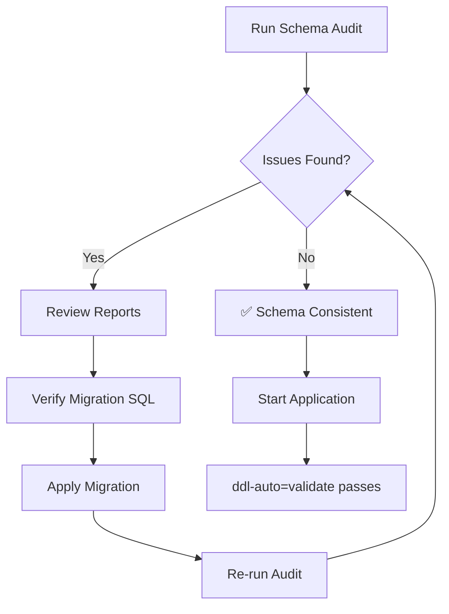

# Schema Consistency Audit Guide

## 🎯 Purpose

Systematically detect schema mismatches between **JPA Entity Definitions** (expected schema) and **PostgreSQL Database** (actual schema) to ensure `ddl-auto=validate` passes without errors.

## 🔍 How It Works

Instead of error-prone regex parsing, this tool:

1. **Loads Hibernate Metamodel** - Extracts table/column definitions from your JPA entities
2. **Queries PostgreSQL** - Reads actual schema from `information_schema.columns`
3. **Compares Schema** - Identifies missing tables, missing columns, extra tables, extra columns
4. **Generates Artifacts**:
   - `schema_audit_report.md` - Human-readable audit report
   - `V999__schema_alignment_missing_columns.sql` - Flyway migration with fixes

## 🚀 Quick Start

### Prerequisites

```bash
# 1. Ensure PostgreSQL is running
docker ps | grep postgres
# OR
psql -h localhost -p 5433 -U postgres -c "SELECT version();"

# 2. Verify database exists
psql -h localhost -p 5433 -U postgres -c "\l" | grep tba_waad_system
```

### Run the Audit

```bash
cd /workspaces/tba_waad_system/backend

# Run the schema audit test
mvn test -Dtest=SchemaAuditTest

# If you have profile issues, specify the default profile
mvn test -Dtest=SchemaAuditTest -Dspring.profiles.active=default
```

### Review Results

```bash
# 1. Check the audit report
cat schema_audit_report.md

# 2. Review the generated migration
cat V999__schema_alignment_missing_columns.sql
```

## 📋 Sample Output

### Console Output

```
═══════════════════════════════════════════════════════════════
  SCHEMA CONSISTENCY AUDIT - Starting...
═══════════════════════════════════════════════════════════════
✓ Extracted expected schema from Hibernate: 45 tables
✓ Queried actual schema from PostgreSQL: 42 tables
✓ Schema comparison complete
✓ Generated audit report: schema_audit_report.md
✓ Generated migration script: V999__schema_alignment_missing_columns.sql

┌─────────────────────────────────────────────────────────┐
│                    AUDIT SUMMARY                        │
├─────────────────────────────────────────────────────────┤
│ Missing Tables:      0                                  │
│ Extra Tables:        2                                  │
│ Missing Columns:     5                                  │
│ Extra Columns:       3                                  │
└─────────────────────────────────────────────────────────┘

⚠️  ACTION REQUIRED: Schema inconsistencies detected!
   1. Review: schema_audit_report.md
   2. Apply:  V999__schema_alignment_missing_columns.sql
═══════════════════════════════════════════════════════════════
```

### Audit Report (`schema_audit_report.md`)

```markdown
## ❌ MISSING COLUMNS (Defined in JPA but not in Database)

### Table: `chronic_conditions`

| Column Name | Type |
|-------------|------|
| `associated_service_codes` | VARCHAR(2000) |

### Table: `users`

| Column Name | Type |
|-------------|------|
| `last_login_at` | TIMESTAMP |
```

### Migration File (`V999__schema_alignment_missing_columns.sql`)

```sql
-- Table: chronic_conditions
ALTER TABLE chronic_conditions 
    ADD COLUMN IF NOT EXISTS associated_service_codes VARCHAR(2000);

-- Table: users
ALTER TABLE users 
    ADD COLUMN IF NOT EXISTS last_login_at TIMESTAMP;
```

## 🔧 Applying the Migration

### Option 1: Via Flyway (Recommended)

```bash
# 1. Move the generated migration to Flyway folder
mv V999__schema_alignment_missing_columns.sql src/main/resources/db/migration/

# 2. Run the application (Flyway will auto-apply)
mvn clean spring-boot:run

# 3. Verify in logs
# Look for: "Successfully applied 1 migration to schema public"
```

### Option 2: Manual SQL Execution

```bash
# Apply directly via psql
psql -h localhost -p 5433 -U postgres -d tba_waad_system \
  -f V999__schema_alignment_missing_columns.sql

# Verify columns were added
psql -h localhost -p 5433 -U postgres -d tba_waad_system -c "
SELECT column_name, data_type 
FROM information_schema.columns 
WHERE table_name = 'chronic_conditions' 
ORDER BY ordinal_position;
"
```

## ✅ Verification

### 1. Run the audit again (should show no issues)

```bash
mvn test -Dtest=SchemaAuditTest
```

Expected output:
```
✅ SUCCESS: Schema is fully consistent!
   All JPA entities match the database schema.
```

### 2. Start the application with `ddl-auto=validate`

```bash
# Ensure application.yml has:
# spring.jpa.hibernate.ddl-auto: validate

mvn clean spring-boot:run
```

Expected output (no errors):
```
Started TbaWaadApplication in 5.234 seconds
```

### 3. Test an entity operation

```bash
# Test creating/reading a chronic condition
curl -X GET http://localhost:8080/api/chronic-conditions
```

## 🔄 Typical Workflow



## 📊 Understanding the Report

### Missing Columns ❌

**Definition**: Columns defined in JPA `@Column` annotations but not present in database

**Impact**: `SchemaManagementException` on startup with `ddl-auto=validate`

**Action**: **MUST** add via migration

### Missing Tables ❌

**Definition**: Entire tables defined via `@Entity` but not in database

**Impact**: Application will fail to start

**Action**: **MUST** create via migration

### Extra Columns ⚠️

**Definition**: Columns in database but no corresponding JPA field

**Impact**: No immediate error, but may indicate:
- Legacy columns (safe to ignore)
- Deprecated fields (consider removing)
- Missing JPA mappings (investigate)

**Action**: Review and decide (no migration needed)

### Extra Tables ⚠️

**Definition**: Tables in database but no corresponding `@Entity`

**Impact**: No error, possibly:
- Legacy tables (safe to ignore)
- Flyway history table (expected)
- Manually created tables (investigate)

**Action**: Review and decide (no migration needed)

## 🛠️ Troubleshooting

### Issue: Test fails with connection error

```
Caused by: org.postgresql.util.PSQLException: Connection refused
```

**Solution**:
```bash
# Check if PostgreSQL is running
docker ps | grep postgres

# Start PostgreSQL if needed
docker start <container-id>

# Verify connection
psql -h localhost -p 5433 -U postgres -c "SELECT 1;"
```

### Issue: Database does not exist

```
FATAL: database "tba_waad_system" does not exist
```

**Solution**:
```bash
# Create the database
psql -h localhost -p 5433 -U postgres -c "CREATE DATABASE tba_waad_system;"

# Run migrations
cd /workspaces/tba_waad_system/backend
mvn clean spring-boot:run
```

### Issue: Authentication failed

```
FATAL: password authentication failed for user "postgres"
```

**Solution**:
```bash
# Check application.yml credentials
grep -A 5 "datasource:" backend/src/main/resources/application.yml

# Update PostgreSQL password if needed
psql -h localhost -p 5433 -U postgres
ALTER USER postgres WITH PASSWORD 'postgres';
```

### Issue: Test compiles but extraction fails

```
java.lang.ClassCastException: cannot cast to MetamodelImplementor
```

**Solution**: This indicates Hibernate version mismatch. The test is designed for Hibernate 6.x (Spring Boot 3.x). If you're on older versions, modify the metamodel extraction logic.

## 🎯 Best Practices

### 1. Run Audit Regularly

```bash
# Before every deployment
mvn test -Dtest=SchemaAuditTest

# Add to CI/CD pipeline
- name: Schema Audit
  run: mvn test -Dtest=SchemaAuditTest
```

### 2. Review Generated Migrations

**Always** inspect `V999__schema_alignment_missing_columns.sql` before applying:

- Verify column types are correct
- Check nullable constraints match business logic
- Add default values if needed
- Consider backward compatibility

### 3. Rename Migration Files

The generated file uses `V999` as a placeholder. Rename to follow your sequence:

```bash
# If your last migration is V006
mv V999__schema_alignment_missing_columns.sql \
   src/main/resources/db/migration/V007__schema_alignment_missing_columns.sql
```

### 4. Archive Old Migrations

If consolidating migrations (like we did with V001-V006), keep old ones for reference:

```bash
mkdir -p src/main/resources/db/migration_archive
mv src/main/resources/db/migration/V0{01..71}*.sql migration_archive/
```

## 📚 Related Documentation

- [FLYWAY-README.md](FLYWAY-README.md) - Main Flyway documentation
- [QUICK-START.md](QUICK-START.md) - 5-minute deployment guide
- [FLYWAY-VERIFICATION-GUIDE.md](FLYWAY-VERIFICATION-GUIDE.md) - Verification procedures

## 🆘 Support

If the audit detects issues you can't resolve:

1. Check the audit report for specific column/table details
2. Review the corresponding `@Entity` class
3. Verify the database schema manually:
   ```sql
   \d+ table_name
   ```
4. Consult Hibernate logs during startup
5. Enable SQL logging in `application.yml`:
   ```yaml
   spring.jpa.show-sql: true
   logging.level.org.hibernate.SQL: DEBUG
   ```

---

**Generated by**: Schema Audit Test  
**Last Updated**: December 28, 2024  
**Version**: 1.0
